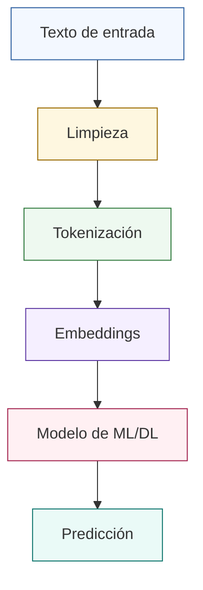
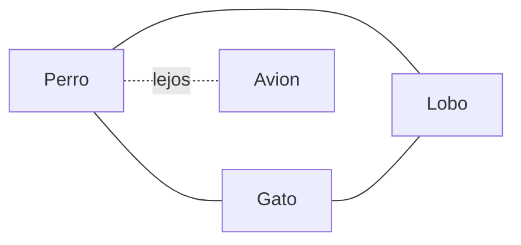
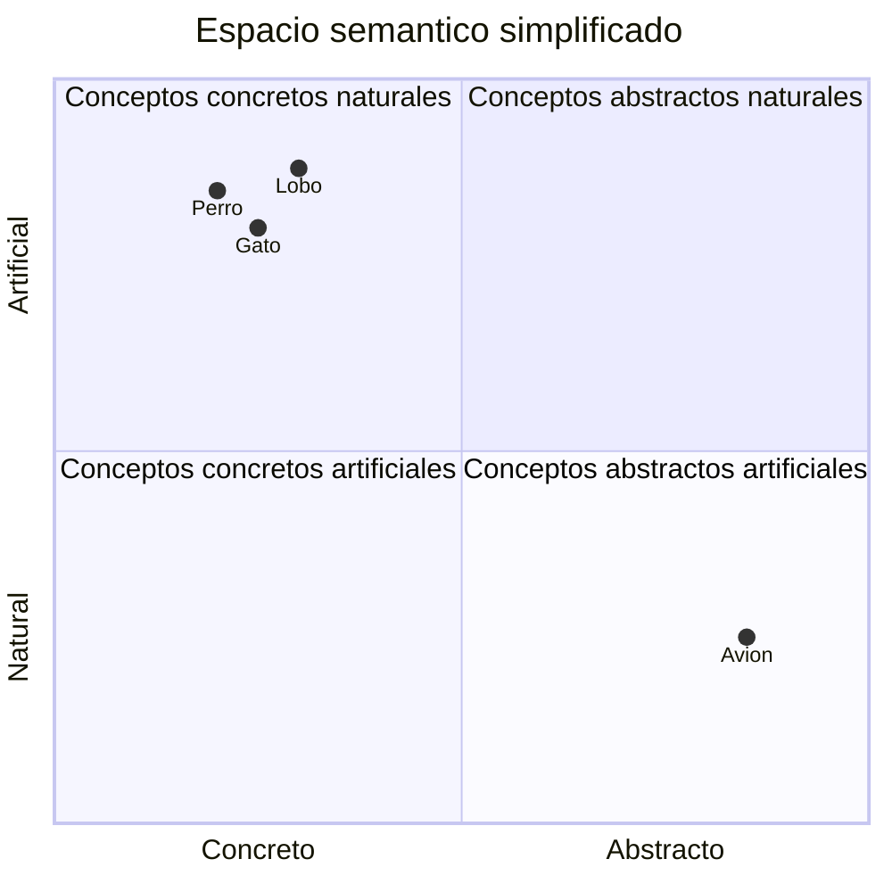
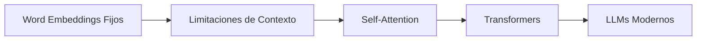

# Módulo: Científico de Datos e Inteligencia Artificial Aplicada

## Unidad 2: NLP y el Auge de la IA Generativa (LLMs)
## Clase 1: Text Mining y Embeddings Contextuales

---

## Objetivos de aprendizaje

Al finalizar esta clase, el estudiante será capaz de:

1. Diseñar un pipeline básico de NLP para problemas supervisados.
2. Aplicar técnicas de preprocesamiento de texto de forma crítica (sin sobrepreprocesar).
3. Tokenizar texto con TensorFlow y convertirlo a secuencias numéricas.
4. Aplicar padding para estandarizar longitudes de entrada.
5. Comprender la evolución de representaciones: One-Hot -> BoW -> TF-IDF -> Embeddings.
6. Implementar y parametrizar una capa `Embedding()` en TensorFlow/Keras.
7. Construir un mini flujo end-to-end: texto crudo -> tensor listo para modelo.
8. Identificar errores comunes y adoptar buenas prácticas de modelado en NLP.

---

## Introducción

### ¿Qué es NLP?

El **Procesamiento de Lenguaje Natural (NLP)** es el área de IA que permite a los sistemas computacionales procesar, entender y generar lenguaje humano. En términos prácticos, transforma texto (y voz, en tareas más amplias) en señales que un modelo puede usar para inferir intención, tema, sentimiento, entidades o relaciones.

### ¿Por qué es importante?

La mayor parte de la información empresarial y social está en formato no estructurado: correos, chats, tickets, reseñas, contratos, publicaciones, documentos clínicos, etc. NLP convierte ese volumen textual en información accionable.

### ¿Qué problemas resuelve?

- Clasificación de texto (spam/no spam, tema, urgencia).
- Análisis de sentimientos.
- Detección de intención en asistentes virtuales.
- Extracción de entidades (personas, lugares, montos, fechas).
- Búsqueda semántica y recomendación basada en texto.
- Resumen automático y generación de texto (con LLMs).

### Casos de uso reales

- **Finanzas**: detección de fraude en descripciones de transacciones.
- **E-commerce**: análisis de reseñas y voz del cliente.
- **Salud**: minería de notas clínicas para codificación y seguimiento.
- **Legal**: clasificación documental y búsqueda inteligente de cláusulas.
- **Soporte**: enrutamiento automático de tickets según intención.

---

## ¿Qué es Text Mining?

El **Text Mining** (minería de texto) es el conjunto de técnicas para extraer patrones, conocimiento y señales útiles a partir de texto no estructurado.

### Conceptos clave

- **Datos no estructurados**: no viven naturalmente en columnas rígidas como en SQL.
- **Objetivo**: convertir lenguaje humano en variables útiles para análisis y modelado.
- **Salida típica**: etiquetas, tópicos, embeddings, métricas de similitud, entidades.

### Ejemplos reales

- Agrupar comentarios de clientes por tema emergente.
- Detectar tendencias de percepción de marca por semana.
- Medir riesgo reputacional en redes sociales.

### Flujo general de trabajo


---

## Pipeline de NLP

Pipeline base para esta clase:

**Texto -> Limpieza -> Tokenización -> Embeddings -> Modelo -> Predicción**



### Lectura técnica del pipeline

- **Limpieza** reduce ruido estadístico.
- **Tokenización** define la granularidad del lenguaje para el modelo.
- **Embeddings** proyectan tokens a un espacio denso y continuo.
- **Modelo** aprende una función objetivo (clasificar, predecir, etc.).
- **Predicción** se evalúa y retroalimenta iteraciones del pipeline.

---

## Preprocesamiento de texto

> Idea central: no existe una limpieza universal. El preprocesamiento debe alinearse con el problema.

A continuación, se presentan pasos frecuentes con explicación, ejemplo y código comentado.

### 1) Convertir a minúsculas

**Qué aporta:** reduce variabilidad artificial (`"Hola"` y `"hola"` se vuelven el mismo token).

**Ejemplo:** `"NLP Es Poderoso" -> "nlp es poderoso"`

```python
texto = "NLP Es Poderoso"
texto = texto.lower()  # Normaliza mayúsculas/minúsculas en un solo formato
print(texto)           # nlp es poderoso
```

### 2) Eliminar caracteres especiales

**Qué aporta:** elimina símbolos que no añaden semántica en tareas estándar.

```python
import re

texto = "Hola!!! ¿Cómo estás? #NLP @2026"
texto = re.sub(r"[^\w\s]", " ", texto)  # Sustituye signos no alfanuméricos por espacio
texto = re.sub(r"\s+", " ", texto).strip()  # Colapsa espacios repetidos y recorta extremos
print(texto)  # Hola Cómo estás NLP 2026
```

### 3) Eliminar números (según contexto)

**Cuándo hacerlo:** si los números no aportan señal (ejemplo: clasificación temática general).

**Cuándo NO:** si predicen la etiqueta (precios, fechas, cantidades, códigos).

```python
import re

texto = "Compré 3 productos por 250 dólares"
texto_sin_numeros = re.sub(r"\d+", "", texto)  # Quita secuencias numéricas
texto_sin_numeros = re.sub(r"\s+", " ", texto_sin_numeros).strip()  # Limpia espacios sobrantes
print(texto_sin_numeros)  # Compré productos por dólares
```

### 4) Manejo de emojis

Los emojis pueden contener sentimiento. Decidir entre eliminar o mapear depende del objetivo.

```python
import re

texto = "Me encantó el curso 😍🔥"
texto_sin_emojis = re.sub(r"[\U00010000-\U0010ffff]", "", texto)  # Elimina caracteres Unicode fuera de BMP
print(texto_sin_emojis)  # Me encantó el curso
```

### 5) Eliminar signos de puntuación

```python
import string

texto = "Hola, mundo. NLP: útil; práctico!"
tabla = str.maketrans("", "", string.punctuation)  # Crea tabla de borrado de puntuación ASCII
texto = texto.translate(tabla)  # Aplica borrado
print(texto)  # Hola mundo NLP útil práctico
```

### 6) Normalizar espacios

```python
import re

texto = "NLP    con   espacios   extra"
texto = re.sub(r"\s+", " ", texto).strip()  # Deja un único espacio entre palabras
print(texto)  # NLP con espacios extra
```

### 7) Stopwords (introducción)

Palabras frecuentes con baja carga semántica para ciertas tareas (`de`, `la`, `y`, etc.).

```python
stopwords = {"de", "la", "y", "el", "en"}
texto = "el analisis de texto en la industria"
tokens = texto.split()  # Tokenización simple por espacios
filtrados = [t for t in tokens if t not in stopwords]  # Conserva tokens informativos
print(filtrados)  # ['analisis', 'texto', 'industria']
```

### 8) Stemming (introducción)

Reduce palabras a una raíz aproximada.

```python
# Requiere: pip install nltk
from nltk.stem import SnowballStemmer

stemmer = SnowballStemmer("spanish")
palabras = ["corriendo", "corrió", "corredor"]
raices = [stemmer.stem(p) for p in palabras]  # Aprox. morfológica
print(raices)
```

### 9) Lemmatization (introducción)

Busca la forma canónica (lema) más lingüísticamente consistente.

```python
# Ejemplo conceptual: en español suele requerir pipelines lingüísticos (spaCy/stanza)
# En inglés, WordNetLemmatizer es un punto de partida clásico.
from nltk.stem import WordNetLemmatizer

lemmatizer = WordNetLemmatizer()
palabras = ["running", "better", "cars"]
lemmas = [lemmatizer.lemmatize(p) for p in palabras]  # Lematización básica
print(lemmas)
```

---

## Tokenización

La **tokenización** divide texto en unidades mínimas útiles llamadas **tokens**.

### ¿Qué es un token?

Un token puede ser:

- una palabra (`"modelo"`)
- un carácter (`"m"`)
- una subpalabra (`"trans"`, `"##former"`)

### Tipos de tokenización

1. **Por palabras**: intuitiva y rápida, pero sensible a vocabulario OOV.
2. **Por caracteres**: robusta a palabras desconocidas, secuencias más largas.
3. **Por subpalabras**: balance entre vocabulario y generalización (base de BPE/WordPiece).

### Tokenización con TensorFlow/Keras

```python
from tensorflow.keras.preprocessing.text import Tokenizer

textos = [
    "me gusta el aprendizaje profundo",
    "el aprendizaje automatico transforma industrias",
]

# num_words limita el vocabulario efectivo; oov_token captura términos fuera del vocabulario
tokenizer = Tokenizer(num_words=1000, oov_token="<OOV>")

# Construye el diccionario token->indice basado en frecuencia
tokenizer.fit_on_texts(textos)

# Convierte cada texto en una lista de enteros
secuencias = tokenizer.texts_to_sequences(textos)

# word_index almacena el mapeo completo aprendido
indice_palabras = tokenizer.word_index

print("Secuencias:", secuencias)
print("Tamaño vocabulario aprendido:", len(indice_palabras))
print("Índice de 'aprendizaje':", indice_palabras.get("aprendizaje"))
```

### Funciones solicitadas

- `Tokenizer(...)`: crea el objeto que construye el vocabulario.
- `texts_to_sequences(...)`: transforma texto en secuencias de IDs.
- `word_index`: diccionario con el índice asignado a cada token.

---

## Padding

### ¿Por qué todas las secuencias deben tener la misma longitud?

Las capas densas y la mayoría de flujos batched en deep learning requieren tensores rectangulares. Si una frase tiene 4 tokens y otra 12, no se puede crear un batch directo sin normalizar longitudes.

### `pad_sequences()`

Permite truncar o rellenar secuencias para una longitud fija.

```python
from tensorflow.keras.preprocessing.sequence import pad_sequences

secuencias = [
    [5, 2, 9],
    [4, 1],
    [7, 3, 8, 6, 2],
]

# padding='post': agrega ceros al final
x_post = pad_sequences(secuencias, maxlen=6, padding="post", truncating="post")

# padding='pre': agrega ceros al inicio
x_pre = pad_sequences(secuencias, maxlen=6, padding="pre", truncating="pre")

print("Padding post:\n", x_post)
print("Padding pre:\n", x_pre)
```

### Lectura de parámetros clave

- `maxlen`: longitud final por secuencia.
- `padding`: `pre` o `post`.
- `truncating`: dónde recortar si excede `maxlen`.
- `value`: valor de relleno (por defecto `0`).

---

## Representación del texto: evolución

| Técnica | Ventajas | Desventajas | Casos de uso recomendados |
|---|---|---|---|
| One Hot Encoding | Simple, interpretable | Vectores gigantes y dispersos; sin semántica | Problemas muy pequeños, prototipos didácticos |
| Bag of Words | Fácil de implementar; útil como baseline | Pierde orden y contexto | Clasificación clásica de documentos |
| TF-IDF | Pondera términos informativos; baseline fuerte | Sigue sin capturar semántica profunda | Búsqueda, clasificación lineal, sistemas ligeros |
| Word Embeddings | Capturan similitud semántica; vectores densos | Requieren datos/entrenamiento; sesgos | NLP moderno, deep learning, tareas semánticas |

---

## Word Embeddings

Los **word embeddings** representan cada palabra como un vector denso en un espacio continuo de dimensión $d$.

### Ideas fundamentales

- Palabras con contextos similares tienden a vectores cercanos.
- La cercanía se mide con distancia (euclidiana) o similitud coseno.
- El espacio vectorial permite capturar relaciones semánticas útiles.

### Intuición geométrica

Si dos palabras aparecen en contextos parecidos (por ejemplo, mascotas o animales), sus vectores tienden a estar más cerca.

- Cercanos: `perro`, `gato`, `lobo`
- Lejanos: `perro`, `avion`





### Métrica común: similitud coseno

$$
\text{sim}(\mathbf{u}, \mathbf{v}) = \frac{\mathbf{u}\cdot\mathbf{v}}{\|\mathbf{u}\|\,\|\mathbf{v}\|}
$$

- Valor cercano a $1$: vectores muy alineados (alta similitud).
- Cercano a $0$: baja relación.
- Cercano a $-1$: relación opuesta en dirección.

---

## Embedding Layer de TensorFlow

La capa `Embedding()` aprende una matriz $W \in \mathbb{R}^{V \times d}$ donde:

- $V$: tamaño del vocabulario
- $d$: dimensión del embedding

Cada índice de palabra accede a una fila de esa matriz.

### Parámetros clave

- `input_dim`: tamaño del vocabulario (máximo índice + 1).
- `output_dim`: dimensión del vector embedding.
- `input_length`: longitud fija de secuencia (útil para definir forma de salida en algunos modelos).

### Ejemplo funcional comentado

```python
import numpy as np
import tensorflow as tf
from tensorflow.keras import Sequential
from tensorflow.keras.layers import Embedding, GlobalAveragePooling1D, Dense

# Supongamos vocabulario de 5000 tokens y secuencias de longitud 20
vocab_size = 5000
embedding_dim = 64
seq_len = 20

# Modelo mínimo para clasificación binaria sobre texto tokenizado
model = Sequential([
    Embedding(
        input_dim=vocab_size,   # Número máximo de tokens distintos que el modelo puede indexar
        output_dim=embedding_dim,  # Dimensión del vector denso por token
        input_length=seq_len,   # Longitud esperada por secuencia de entrada
    ),
    GlobalAveragePooling1D(),   # Agrega información de tokens en un solo vector por ejemplo
    Dense(32, activation="relu"),  # Capa oculta para no linealidad
    Dense(1, activation="sigmoid")  # Salida binaria (0/1)
])

model.compile(
    optimizer="adam",              # Optimizador robusto para inicio rápido
    loss="binary_crossentropy",    # Pérdida para clasificación binaria
    metrics=["accuracy"],          # Métrica de monitoreo
)

# Datos sintéticos de ejemplo: enteros entre 1 y vocab_size-1
x_demo = np.random.randint(1, vocab_size, size=(8, seq_len))
y_demo = np.random.randint(0, 2, size=(8,))

history = model.fit(
    x_demo, y_demo,
    epochs=2,        # Solo demostración
    verbose=1
)
```

---

## Ejemplo práctico paso a paso (mini proyecto)

Objetivo: transformar frases en español a tensores listos para una red neuronal con capa de embeddings.

```python
import re
import numpy as np
from tensorflow.keras.preprocessing.text import Tokenizer
from tensorflow.keras.preprocessing.sequence import pad_sequences
from tensorflow.keras import Sequential
from tensorflow.keras.layers import Embedding, GlobalAveragePooling1D, Dense

# 1) Dataset de juguete: texto + etiqueta (1=positivo, 0=negativo)
textos = [
    "Me encantó la clase de NLP, muy clara y útil",
    "El laboratorio estuvo confuso y largo",
    "Excelente explicación de embeddings",
    "No entendí bien la tokenización",
    "Muy buen contenido práctico",
    "Demasiada teoría sin ejemplos",
]
etiquetas = np.array([1, 0, 1, 0, 1, 0])

# 2) Función de limpieza mínima y conservadora
# Evita sobrepreprocesar: mantenemos palabras importantes y solo quitamos ruido evidente.
def limpiar_texto(t):
    t = t.lower()                               # Normaliza mayúsculas/minúsculas
    t = re.sub(r"[^a-záéíóúñ\s]", " ", t)     # Conserva letras del español y espacios
    t = re.sub(r"\s+", " ", t).strip()         # Elimina espacios duplicados
    return t

textos_limpios = [limpiar_texto(t) for t in textos]  # Aplica limpieza a todo el dataset

# 3) Tokenización con OOV para palabras no vistas
tokenizer = Tokenizer(num_words=1000, oov_token="<OOV>")
tokenizer.fit_on_texts(textos_limpios)               # Aprende vocabulario

# 4) Texto -> secuencias numéricas
secuencias = tokenizer.texts_to_sequences(textos_limpios)

# 5) Padding para longitud uniforme
max_len = 10
x = pad_sequences(
    secuencias,
    maxlen=max_len,
    padding="post",      # Rellena al final
    truncating="post",   # Recorta al final si excede longitud
)

# 6) Configurar tamaño real de vocabulario (limitado por num_words)
vocab_real = min(len(tokenizer.word_index) + 1, 1000)

# 7) Modelo con Embedding
model = Sequential([
    Embedding(input_dim=vocab_real, output_dim=32, input_length=max_len),  # Proyección densa de tokens
    GlobalAveragePooling1D(),                                              # Resume secuencia
    Dense(16, activation="relu"),                                         # Capa intermedia
    Dense(1, activation="sigmoid")                                        # Salida binaria
])

model.compile(optimizer="adam", loss="binary_crossentropy", metrics=["accuracy"])

# 8) Entrenamiento corto demostrativo
model.fit(x, etiquetas, epochs=10, verbose=0)

# 9) Inferencia con nuevas frases
nuevos = [
    "la clase fue excelente y clara",
    "contenido confuso y poco practico",
]

nuevos_limpios = [limpiar_texto(t) for t in nuevos]        # Reusar exactamente la misma limpieza
nuevas_secuencias = tokenizer.texts_to_sequences(nuevos_limpios)  # Reusar tokenizer entrenado
x_new = pad_sequences(nuevas_secuencias, maxlen=max_len, padding="post", truncating="post")

pred = model.predict(x_new, verbose=0)
for texto, p in zip(nuevos, pred.ravel()):
    etiqueta = "positivo" if p >= 0.5 else "negativo"
    print(f"{texto} -> {etiqueta} ({p:.3f})")
```

### Qué observar durante la práctica

- Impacto de `num_words` en cobertura de vocabulario.
- Efecto de `max_len` sobre truncamiento y pérdida de contexto.
- Sensibilidad del modelo con datasets pequeños.

---

## Buenas prácticas

1. Definir reglas de limpieza según el dominio, no por plantilla fija.
2. Evitar eliminar información útil (negaciones, números relevantes, emojis de sentimiento).
3. Reservar token OOV para robustez en producción.
4. Ajustar `num_words` con análisis de frecuencia y memoria disponible.
5. Elegir dimensión de embedding según tamaño de dataset y complejidad del problema.
6. Validar diferentes longitudes máximas de secuencia (`max_len`).
7. Mantener consistencia exacta entre preprocesamiento de entrenamiento e inferencia.
8. Monitorear métricas más allá de accuracy (F1, recall, matriz de confusión).

---

## Errores comunes

- Olvidar aplicar `pad_sequences()` antes de entrenar.
- Usar un vocabulario excesivamente pequeño y perder señal semántica.
- Eliminar demasiados elementos (sobrepreprocesamiento).
- Cambiar reglas de limpieza entre train y test.
- No controlar OOV, causando comportamiento inestable con texto real.
- Elegir `max_len` sin evidencia (ni percentiles ni análisis exploratorio).

---

## Ejercicio práctico para clase (sin resolver)

### Laboratorio guiado

Dado un dataset de reseñas cortas en español:

1. Diseñar una función de limpieza mínima y justificar cada regla.
2. Tokenizar el corpus con `Tokenizer` usando `oov_token`.
3. Convertir textos a secuencias con `texts_to_sequences`.
4. Aplicar `pad_sequences` con al menos dos valores de `max_len`.
5. Construir un modelo simple con `Embedding + GlobalAveragePooling1D + Dense`.
6. Comparar resultados entre configuraciones de longitud y vocabulario.

### Entregables

- Notebook con celdas ejecutables.
- Breve reporte (1-2 páginas) con decisiones de diseño y hallazgos.
- Tabla de errores de predicción y análisis cualitativo.

---

## Reto adicional (dificultad media)

Construir un clasificador de sentimiento con un conjunto pequeño de reseñas (por ejemplo, 200-500 textos).

### Requisitos del reto

- Crear particiones train/validación.
- Probar dos tamaños de embedding (por ejemplo 32 y 128).
- Probar dos estrategias de `max_len` (p50 vs p90 de longitudes).
- Reportar F1 y no solo accuracy.
- Analizar 10 falsos positivos y 10 falsos negativos.

> No usar modelos preentrenados todavía. El objetivo es consolidar fundamentos.

---

## Resumen de conceptos

| Concepto | Idea clave | Herramienta principal | Riesgo frecuente |
|---|---|---|---|
| NLP | Convertir lenguaje en señales modelables | Ecosistema Python + DL | Suponer que texto "ya está limpio" |
| Text Mining | Extraer patrones desde texto no estructurado | Preprocesamiento + modelado | Limpieza no alineada al negocio |
| Tokenización | Texto -> tokens | `Tokenizer` | OOV no gestionado |
| Secuencias | Tokens -> enteros | `texts_to_sequences` | Inconsistencia entre train/inferencia |
| Padding | Longitud uniforme por batch | `pad_sequences` | Truncar información crítica |
| Embeddings | Vectores densos semánticos | `Embedding` | Dimensión no calibrada |
| Similitud semántica | Cercanía en espacio vectorial | Coseno / distancia | Interpretación geométrica superficial |
| Pipeline NLP | Flujo extremo a extremo | Diseño reproducible | Fragmentar etapas sin control |

---

## Preparación para la siguiente clase

### Próximo tema: Transformers y Self-Attention

Los word embeddings fueron revolucionarios porque permitieron pasar de representaciones dispersas a espacios densos con semántica. Sin embargo, tienen limitaciones importantes:

1. Una misma palabra suele tener un único vector fijo (ambigüedad de contexto).
2. Capturan contexto de forma indirecta y limitada por arquitectura.
3. El modelado de dependencias largas puede degradarse.

Los **Transformers** introducen **Self-Attention**, permitiendo que cada token “mire” a los demás tokens de la secuencia con pesos dinámicos según contexto. Esto habilita representaciones contextuales más ricas y explica su impacto en LLMs.



### Preguntas de puente para la próxima sesión

- ¿Cómo cambia el vector de la palabra “banco” entre contexto financiero y geográfico?
- ¿Qué gana el modelo cuando cada token pondera dinámicamente a los demás?
- ¿Por qué la atención escaló mejor que RNN/LSTM en tareas de largo contexto?

---

