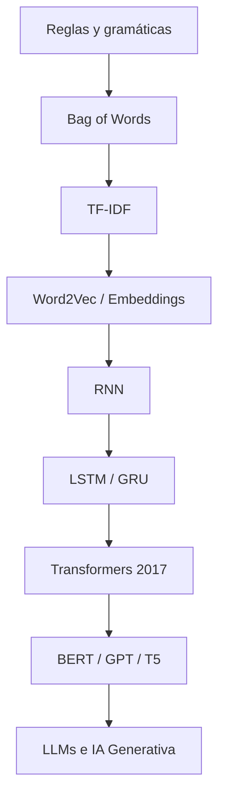

# Módulo: Científico de Datos e Inteligencia Artificial Aplicada

## Unidad 2: NLP y el Auge de la IA Generativa (LLMs)
## Clase 2: La Revolución de los Transformers

---

> **Duración estimada:** 4 a 6 horas presenciales  
> **Prerrequisito:** Clase 1 — Text Mining y Embeddings  
> **Material práctico:** carpeta `Clase-02-La-Revolucion-de-los-Transformers/notebooks/`

---

## 1. Introducción — La historia del NLP contada como evolución

Imagina que quieres que una computadora entienda un correo de un cliente, traduzca un contrato legal o responda una pregunta sobre un manual técnico. Durante décadas, los investigadores intentaron enseñar a las máquinas a procesar lenguaje humano con enfoques cada vez más sofisticados. Lo que hoy conocemos como ChatGPT, Claude o Gemini no nació de la nada: es el resultado de una cadena de avances que comenzó con reglas escritas a mano y terminó en modelos de miles de millones de parámetros.

Todo comenzó con **reglas**. En los años 60 y 70, los primeros sistemas de NLP eran essentially diccionarios y gramáticas codificadas manualmente. Si querías detectar una fecha, escribías una expresión regular; si querías traducir, definías reglas sintácticas palabra por palabra. Funcionaba en dominios muy acotados, pero era frágil: cada excepción requería una regla nueva, y el lenguaje humano — lleno de ironía, ambigüedad y contexto — desbordaba cualquier manual.

Luego llegó el enfoque estadístico. En lugar de escribir reglas, los investigadores empezaron a **contar palabras**. El **Bag of Words (BoW)** representaba un documento como un saco de términos, ignorando el orden. Era revolucionario porque aprendía patrones desde datos, no desde reglas humanas. Si la palabra "excelente" aparecía frecuentemente en reseñas positivas, el modelo aprendía esa asociación. Pero BoW tenía un problema grave: "El perro mordió al hombre" y "El hombre mordió al perro" producían exactamente la misma representación.

Para corregir parcialmente eso, nació **TF-IDF** (Term Frequency – Inverse Document Frequency). No solo contaba cuántas veces aparecía una palabra en un documento, sino qué tan rara era en todo el corpus. Palabras como "el" o "de" perdían peso; términos distintivos como "transformer" o "fraudulento" ganaban relevancia. TF-IDF sigue siendo útil hoy como baseline en clasificación de documentos y búsqueda, pero aún no capturaba **semántica**: "coche" y "automóvil" eran palabras completamente distintas para el modelo.

El salto semántico llegó con **Word2Vec** (2013). Por primera vez, cada palabra se representaba como un **vector denso** en un espacio continuo donde palabras con significados similares quedaban cerca. "Rey" - "Hombre" + "Mujer" ≈ "Reina" se volvió el ejemplo clásico. Word2Vec aprendía embeddings a partir del contexto en grandes corpus. Sin embargo, cada palabra tenía **un solo vector fijo**, sin importar si "banco" significaba institución financiera o asiento del parque.

Para capturar **secuencias y dependencias temporales**, aparecieron las **Redes Neuronales Recurrentes (RNN)**. Procesaban texto palabra por palabra, manteniendo un "estado oculto" que acumulaba memoria de lo leído. Funcionaban razonablemente en frases cortas, pero sufrían con textos largos: al final de un párrafo, la información del inicio se había "desvanecido" — el famoso problema del **gradiente que desaparece**.

Las **LSTM** (Long Short-Term Memory, 1997, popularizadas en 2010s) intentaron resolver esto con compuertas que decidían qué recordar y qué olvidar. Mejoraron el modelado de dependencias a mediano plazo y dominaron traducción automática y generación de texto durante años. Pero seguían siendo **secuenciales**: no podían procesar todas las palabras en paralelo, lo que las hacía lentas para entrenar a escala. Además, con textos muy largos, la memoria seguía siendo limitada.

En 2017, un equipo de Google publicó el paper **"Attention Is All You Need"** y presentó la arquitectura **Transformer**. La idea central fue radical: eliminar por completo la recurrencia y usar un mecanismo de **Self-Attention** que permitía a cada palabra "mirar" directamente a todas las demás palabras de la secuencia, en paralelo. Esto no solo resolvió el cuello de botella de velocidad, sino que capturó dependencias a largo plazo con una elegancia que las RNN nunca lograron.

Los Transformers habilitaron una nueva generación de modelos preentrenados a escala masiva: **BERT** (2018) para comprensión bidireccional, **GPT** (2018) para generación autoregresiva, **T5** (2019) para texto-a-texto. Entrenados con cientos de gigabytes de texto, estos modelos aprendieron representaciones del lenguaje tan ricas que podían adaptarse a casi cualquier tarea con poco ajuste adicional. A partir de GPT-3 (2020) y modelos posteriores, entramos en la era de los **Large Language Models (LLMs)** y la **IA Generativa** moderna: ChatGPT, Claude, Gemini, Copilot, DeepSeek, Llama y Mistral son descendientes directos de esa arquitectura de 2017.

Esta clase recorre ese camino con profundidad: desde los problemas que motivaron los Transformers hasta cómo funcionan ChatGPT y sus contemporáneos por dentro.



---

## 2. Objetivos de aprendizaje

Al finalizar esta clase, el estudiante será capaz de:

1. Explicar la evolución histórica del NLP desde reglas hasta LLMs, identificando las limitaciones de cada etapa.
2. Describir por qué surgieron los Transformers y qué problemas de RNN/LSTM resolvieron.
3. Interpretar el paper "Attention Is All You Need" y su impacto en la industria y la academia.
4. Explicar Self-Attention, Query, Key, Value y Scaled Dot-Product Attention con ejemplos concretos.
5. Comprender Multi-Head Attention, Positional Encoding y la arquitectura completa del Transformer.
6. Diferenciar arquitecturas Encoder-only, Decoder-only y Encoder-Decoder con casos de uso apropiados.
7. Describir el entrenamiento y aplicaciones de BERT (Masked LM) y GPT (predicción autoregresiva).
8. Configurar parámetros de generación: temperatura, top-p, top-k y context window.
9. Comparar modelos modernos (BERT, GPT, T5, Claude, Gemini, Llama, Mistral, DeepSeek) en arquitectura y fortalezas.
10. Implementar y visualizar mecanismos de atención con PyTorch y Hugging Face Transformers.
11. Aplicar pipelines de BERT para clasificación, QA y NER; y pipelines de GPT para generación y reescritura.
12. Identificar al menos 20 casos de uso empresarial real de arquitecturas Transformer y LLMs.

---

## 3. Historia de los Transformers

### ¿Por qué Google creó los Transformers?

En 2016-2017, Google Brain y Google Research trabajaban intensamente en **traducción automática neural (NMT)**. El estado del arte usaba arquitecturas **Encoder-Decoder con LSTM** y un mecanismo de **atención** que permitía al decoder "mirar" partes relevantes del texto fuente. Funcionaba, pero era **lento**: las LSTM procesan secuencia por secuencia, imposibilitando paralelización eficiente en GPUs.

El equipo — Ashish Vaswani, Noam Shazeer, Niki Parmar, Jakob Uszkoreit, Llion Jones, Aidan N. Gomez, Łukasz Kaiser e Illia Polosukhin — se preguntó: **¿y si eliminamos la recurrencia por completo y usamos solo atención?**

### ¿Qué problema intentaban resolver?

| Problema | RNN/LSTM | Solución Transformer |
|---|---|---|
| Procesamiento secuencial lento | Una palabra a la vez | Paralelización total |
| Dependencias a largo plazo | Memoria que se degrada | Atención directa entre cualquier par de tokens |
| Entrenamiento a escala | Semanas en corpus grandes | Horas/días con mismo hardware |
| Transferencia entre tareas | Reentrenar desde cero | Preentrenamiento + fine-tuning |

### El paper "Attention Is All You Need" (2017)

- **Título completo:** "Attention Is All You Need"
- **Publicación:** NeurIPS 2017
- **Modelo propuesto:** Transformer (originalmente para traducción EN-DE)
- **Contribución clave:** arquitectura basada exclusivamente en mecanismos de atención, sin recurrencia ni convoluciones
- **Resultado:** superó al estado del arte en traducción con menor costo computacional de entrenamiento

### ¿Por qué cambió la historia de la IA?

1. **Escalabilidad:** permitió entrenar modelos cada vez más grandes aprovechando hardware paralelo.
2. **Preentrenamiento masivo:** BERT y GPT demostraron que aprender representaciones generales del lenguaje es transferible a casi cualquier tarea.
3. **Democratización:** Hugging Face y similares hicieron accesibles modelos de millones de parámetros con pocas líneas de código.
4. **IA Generativa:** GPT-2, GPT-3, GPT-4 y sus sucesores convirtieron la generación de texto en una capacidad general de propósito.

### Impacto e adopción empresarial

| Empresa | Adopción |
|---|---|
| Google | BERT en Search, T5 en múltiples productos, Gemini como LLM multimodal |
| OpenAI | GPT series, ChatGPT, API de IA generativa |
| Microsoft | Inversión en OpenAI, Copilot en Office y GitHub |
| Meta | LLaMA (modelos open source) |
| Amazon | Alexa, AWS Bedrock con múltiples LLMs |
| Anthropic | Claude (familia de LLMs con enfoque en seguridad) |
| Mistral AI | Modelos europeos open source de alto rendimiento |
| DeepSeek | LLMs open source competitivos con eficiencia de entrenamiento |

> **Nota para el docente:** En este punto, detener la clase 15 minutos. Mostrar el notebook `01_Historia_Transformers.ipynb` y preguntar: *"¿Qué problema de la Clase 1 (embeddings fijos) creen que los Transformers resuelven?"*. Relacionar con la pregunta puente del README de la Clase 1.

---

## 4. Explicación conceptual — Todos los bloques del Transformer

### 4.1 Problemas de las RNN

Las **Redes Neuronales Recurrentes** procesan secuencias manteniendo un estado oculto $h_t$ que se actualiza en cada paso:

```
Entrada: x₁ → x₂ → x₃ → ... → xₙ
Estado:  h₁ → h₂ → h₃ → ... → hₙ
```

**Problemas concretos:**

1. **Gradiente que desaparece:** al retropropagar el error a través de muchos pasos temporales, los gradientes se multiplican por valores pequeños y tienden a cero. El modelo "olvida" el inicio de frases largas.

2. **Procesamiento secuencial:** no se puede paralelizar el entrenamiento sobre la dimensión temporal. Entrenar en corpus de millones de oraciones es extremadamente lento.

3. **Cuello de botella informativo:** toda la información de la secuencia debe comprimirse en un vector de tamaño fijo $h_n$. Es como intentar resumir un libro en una sola frase antes de responder una pregunta.

**Analogía:** imagina escuchar una conversación donde solo puedes recordar la última frase que escuchaste, y cada minuto se borra un poco de lo anterior. Eso es una RNN con secuencias largas.

**Ejemplo real:** traducir "The cat that the dog chased was black" — para traducir "was" correctamente al final, el modelo necesita recordar "cat" del inicio. Las RNN fallan frecuentemente en estas dependencias largas.

### 4.2 Problemas de las LSTM

Las **LSTM** añadieron compuertas (forget, input, output) para controlar qué información conservar:

```
fₜ = σ(Wf · [hₜ₋₁, xₜ])   ← compuerta de olvido
iₜ = σ(Wi · [hₜ₋₁, xₜ])   ← compuerta de entrada
Cₜ = fₜ * Cₜ₋₁ + iₜ * C̃ₜ  ← celda de memoria
```

**Mejoras:** mejor manejo de dependencias a mediano plazo (10-50 tokens).

**Problemas persistentes:**

1. **Siguen siendo secuenciales** — no paralelizables.
2. **Complejidad computacional** — 4 compuertas por paso temporal multiplican parámetros y tiempo.
3. **Atención limitada** — aunque se añadió atención sobre LSTM (Bahdanau, 2014), el encoder seguía comprimiendo todo en un vector.

**Analogía:** una LSTM es como tomar notas en una libreta con secciones resaltadas: mejor que memorizar solo la última frase, pero sigues leyendo el libro página por página, sin poder saltar al capítulo relevante directamente.

### 4.3 ¿Qué es Self-Attention?

**Prestar atención**, en la vida cotidiana, significa decidir en qué enfocarte cuando hay mucha información disponible. Si alguien te pregunta "¿de qué color era el coche?", tu mente no repasa toda tu vida: **prestas atención** a la parte del recuerdo donde se mencionó el coche.

En un Transformer, **Self-Attention** (auto-atención) permite que **cada palabra de la secuencia calcule cuánta atención prestar a cada otra palabra**, incluyéndose a sí misma.

**Analogía de leer un libro:** cuando lees "Juan le dio el libro a María porque ella tenía hambre de lectura", tu cerebro conecta "ella" con "María" sin releer todo el párrafo desde el inicio. Self-Attention hace exactamente eso, pero de forma matemática y paralela.

### 4.4 Query, Key y Value (Q, K, V)

Piensa en un **buscador web**:

| Concepto | Analogía | Rol en Self-Attention |
|---|---|---|
| **Query (Q)** | Tu pregunta en Google | Lo que la palabra actual "busca" o necesita saber |
| **Key (K)** | Título de cada página | Lo que cada palabra "ofrece" o anuncia sobre sí misma |
| **Value (V)** | Contenido de la página | La información real que se transfiere si hay match |

**Proceso simplificado:**

1. Cada palabra genera su Query, Key y Value (proyecciones lineales de su embedding).
2. La Query de la palabra A se compara con las Keys de **todas** las palabras (producto punto).
3. Los scores se normalizan con softmax → **pesos de atención**.
4. La salida es una suma ponderada de todos los Values según esos pesos.

**Ejemplo central:** "El perro mordió al hombre porque **él** estaba asustado."

- Para resolver quién es "él", la Query de "él" busca Keys de palabras con rasgos de "agente asustado".
- "perro" tendrá un peso de atención alto; "hombre" tendrá peso bajo.
- El Value de "perro" domina la representación actualizada de "él".

### 4.5 Scaled Dot-Product Attention

Fórmula:

$$\text{Attention}(Q, K, V) = \text{softmax}\left(\frac{QK^T}{\sqrt{d_k}}\right)V$$

Donde $d_k$ es la dimensión de las Keys.

**¿Por qué dividir por $\sqrt{d_k}$?** Sin escalado, los productos punto crecen con la dimensión y el softmax se satura (da pesos casi 0 o casi 1), dificultando el aprendizaje. El factor $\sqrt{d_k}$ mantiene los valores en un rango estable.

**Ejemplo numérico simplificado (3 palabras, $d_k = 2$):**

```
Palabras: ["gato", "persigue", "ratón"]

Scores sin escalar: Q·Kᵀ = [[2.1, 0.3, 1.8], ...]
Softmax fila 1: [0.52, 0.08, 0.40]  → "gato" atiende más a "gato" y "ratón"

Scores escalados: Q·Kᵀ / √2 = [[1.48, 0.21, 1.27], ...]
Softmax fila 1: [0.41, 0.12, 0.47]  → distribución más suave, mejor gradiente
```

### 4.6 Multi-Head Attention

**¿Por qué existe?** Una sola cabeza de atención aprende un solo tipo de relación. Pero el lenguaje tiene múltiples relaciones simultáneas: sintácticas, semánticas, de co-referencia, temporales, etc.

**Analogía del automóvil:**

Imagina que observas un coche en la calle. No lo analizas con un solo criterio:

| Cabeza | Qué analiza |
|---|---|
| Cabeza 1 | Color |
| Cabeza 2 | Tamaño |
| Cabeza 3 | Velocidad |
| Cabeza 4 | Conductor |
| Cabeza 5 | Marca |
| Cabeza 6 | Estado (nuevo/usado) |

Cada "cabeza" captura un aspecto diferente. Al final, combinas todas las observaciones para una comprensión completa.

En Multi-Head Attention, el modelo tiene **h cabezas independientes** (típicamente 8, 12 o 16). Cada cabeza aprende Q, K, V propios, calcula atención por separado, y al final se concatenan y proyectan.

```
MultiHead(Q,K,V) = Concat(head₁, ..., headₕ) · W^O
donde headᵢ = Attention(Q·Wᵢ^Q, K·Wᵢ^K, V·Wᵢ^V)
```

**Ejemplo en la frase "María le dijo a Ana que ella ganó la beca":**

- Cabeza 1 (sintáctica): conecta "dijo" con "María" (sujeto)
- Cabeza 2 (co-referencia): conecta "ella" con "Ana" o "María"
- Cabeza 3 (semántica): conecta "beca" con "ganó"

### 4.7 Positional Encoding

**Problema:** Self-Attention es **invariante al orden**. Si permutas las palabras, los pesos de atención entre pares iguales serían los mismos. Pero el orden importa enormemente en lenguaje.

**Ejemplos donde el orden cambia el significado:**

| Frase A | Frase B | Diferencia |
|---|---|---|
| "El perro mordió al hombre" | "El hombre mordió al perro" | Agente y paciente invertidos |
| "No quiero ir" | "Quiero no ir" | Negación en posición distinta |
| "Solo ella aprobó" | "Ella solo aprobó" | Enfoque distinto |
| "Dar un paso atrás" | "Atrás un paso dar" | Incomprensible |

**Solución:** sumar vectores de **Positional Encoding** a los embeddings de entrada. Cada posición (0, 1, 2, ...) recibe un patrón único.

En el Transformer original se usan funciones sinusoidales:

$$PE_{(pos, 2i)} = \sin(pos / 10000^{2i/d})$$
$$PE_{(pos, 2i+1)} = \cos(pos / 10000^{2i/d})$$

Modelos modernos (BERT, GPT) usan **positional embeddings aprendidos** o **RoPE** (Rotary Position Embedding) en modelos recientes como LLaMA.

### 4.8 Embeddings en el Transformer

Los embeddings convierten tokens (IDs enteros) en vectores densos de dimensión $d_{model}$ (512 en el paper original, 768 en BERT-base, 4096+ en LLMs grandes).

A diferencia de Word2Vec:
- Son **contextuales**: el vector de "banco" cambia según la oración.
- Se **entrenan end-to-end** con el resto del modelo.
- Se **suman** con positional encoding antes de entrar a las capas de atención.

### 4.9 Arquitectura Transformer — Bloque por bloque

```
Entrada (texto)
    ↓
[Tokenización → IDs]
    ↓
[Embedding Layer]          ← cada token → vector denso
    ↓
[Positional Encoding]      ← inyecta información de posición
    ↓
┌─────────────────────────────────┐
│  BLOQUE TRANSFORMER (×N capas)  │
│                                 │
│  [Multi-Head Self-Attention]    │ ← cada token mira a todos
│           ↓                     │
│  [Add & Norm] (Residual + LN)   │ ← conexión residual + normalización
│           ↓                     │
│  [Feed Forward Network]         │ ← MLP por token (2 capas lineales + ReLU)
│           ↓                     │
│  [Add & Norm] (Residual + LN)   │
└─────────────────────────────────┘
    ↓
[Capa de salida / Proyección]
    ↓
Predicción (traducción, clasificación, siguiente token, etc.)
```

#### Feed Forward Network (FFN)

Dos capas lineales con activación ReLU (o GELU en modelos modernos), aplicadas **independientemente a cada token**:

$$\text{FFN}(x) = \text{ReLU}(xW_1 + b_1)W_2 + b_2$$

Dimensión interna típica: $4 \times d_{model}$ (2048 para $d_{model}=512$).

**Rol:** añade capacidad de transformación no lineal después de la atención. La atención "mezcla" información entre tokens; el FFN "procesa" cada token enriquecido.

#### Residual Connections

$$\text{output} = \text{LayerNorm}(x + \text{Sublayer}(x))$$

**¿Por qué?** Permiten que el gradiente fluya directamente a través de capas anteriores, facilitando el entrenamiento de redes muy profundas (6, 12, 24, 96+ capas).

**Analogía:** es como tomar apuntes (residual) y añadir un resumen (salida de la subcapa), en lugar de reemplazar los apuntes completamente.

#### Layer Normalization

Normaliza activaciones por feature, estabilizando el entrenamiento. Se aplica **antes** de cada subcapa en el diseño Pre-LN moderno (GPT, LLaMA) o **después** en el diseño Post-LN original.

---

## 5. Self-Attention — Diez ejemplos resueltos

### Ejemplo 1: Co-referencia de pronombres
**Frase:** "El perro mordió al hombre porque **él** estaba asustado."
**Resolución:** "él" → "perro" (alta atención). El perro estaba asustado, no la víctima.

### Ejemplo 2: Co-referencia alternativa
**Frase:** "El perro mordió al hombre porque **él** se acercó demasiado."
**Resolución:** "él" → "hombre" (alta atención). El hombre se acercó, provocando la mordida.

### Ejemplo 3: Ambigüedad de "banco"
**Frase:** "Fui al **banco** a retirar dinero."
**Contexto activado:** tokens "retirar", "dinero" → embedding de "banco" se orienta a institución financiera.

### Ejemplo 4: Ambigüedad de "banco" (otro sentido)
**Frase:** "Me senté en un **banco** del parque."
**Contexto activado:** tokens "senté", "parque" → embedding de "banco" se orienta a mobiliario.

### Ejemplo 5: Negación
**Frase:** "**No** me gustó la película."
**Resolución:** "No" modifica fuertemente la representación de "gustó" → sentimiento negativo.

### Ejemplo 6: Relación sujeto-verbo
**Frase:** "Los **gatos** que viven aquí **maullan** mucho."
**Resolución:** "maullan" atiende a "gatos" (número plural, acción de gato).

### Ejemplo 7: Pregunta-respuesta implícita
**Frase:** "¿**Quién** escribió Cien Años de Soledad? Gabriel García Márquez."
**Resolución:** "Quién" establece expectativa de persona; "Gabriel" recibe alta atención como respuesta.

### Ejemplo 8: Causalidad
**Frase:** "Cancelaron el vuelo **porque** llovió intensamente."
**Resolución:** "porque" conecta "Cancelaron" con "llovió" como causa.

### Ejemplo 9: Comparación
**Frase:** "Este modelo es **más** rápido **que** el anterior."
**Resolución:** "más" y "que" vinculan "modelo" con "anterior" en relación comparativa.

### Ejemplo 10: Temporalidad
**Frase:** "**Antes** de la clase revisé los apuntes; **después** hice el laboratorio."
**Resolución:** "Antes" atiende a "revisé"; "después" atiende a "hice". Orden temporal preservado por positional encoding + atención.

### Ejemplo 11: Voz pasiva
**Frase:** "El contrato **fue firmado** por el abogado."
**Resolución:** "firmado" conecta con "contrato" (tema) y "abogado" (agente).

### Ejemplo 12: Ironía (desafío)
**Frase:** "Qué **genial**, otra reunión a las 7 am."
**Resolución:** "genial" recibe atención de "7 am" y contexto negativo → sentimiento irónico (requiere mucho entrenamiento).

> **Nota para el docente:** Trabajar los ejemplos 1 y 2 en pizarra. Preguntar: *"¿Cómo sabe el modelo a qué se refiere 'él'? ¿Qué pasa si cambiamos 'asustado' por 'agresivo'?"*. Luego abrir notebook `02_Embeddings_Tokenizacion_SelfAttention.ipynb`.

---

## 6. Multi-Head Attention — Explicación extendida

Retomando la analogía del automóvil: un Transformer con 8 cabezas es como un equipo de 8 analistas observando la misma oración, cada uno especializado en un tipo de relación.

**Problema que resuelve:** una sola cabeza tiende a promediar relaciones heterogéneas, perdiendo señal. Múltiples cabezas permiten **especialización espontánea** durante el entrenamiento.

**Evidencia empírica:** visualizaciones de BERT muestran que algunas cabezas se especializan en:
- Dependencias sintácticas (sujeto-verbo)
- Co-referencia de pronombres
- Relaciones de adyacencia (palabras vecinas)
- Patrones posicionales (inicio/fin de oración)

**Parámetros típicos:**

| Modelo | Cabezas | $d_{model}$ | $d_k$ por cabeza |
|---|---|---|---|
| Transformer-base | 8 | 512 | 64 |
| BERT-base | 12 | 768 | 64 |
| GPT-2 medium | 16 | 1024 | 64 |
| LLaMA-7B | 32 | 4096 | 128 |

---

## 7. Positional Encoding — Ejemplos de orden

| # | Frase | Significado |
|---|---|---|
| 1 | "Perro muerde hombre" | Noticia normal sobre un perro agresivo |
| 2 | "Hombre muerde perro" | Noticia insólita, implica agresividad humana |
| 3 | "Ayer comí pizza" vs "Pizza comí ayer" | Segunda es agramatical en español estándar |
| 4 | "Solo ella aprobó" vs "Ella solo aprobó" | Primera: única aprobada; segunda: hizo poco más que aprobar |
| 5 | "El cliente canceló porque el producto falló" vs "El producto falló porque el cliente canceló" | Causalidad invertida |

Sin positional encoding, un Transformer trataría la frase 1 y una versión permutada como equivalentes. Por eso **siempre** se inyecta información posicional.

---

## 8. Arquitectura Transformer — Diagrama ASCII completo

```
                    ENTRADA: "Traduce al español: Hello world"
                              │
                    ┌─────────┴─────────┐
                    │   TOKENIZACIÓN    │
                    │  [101, 8765,  ... │
                    └─────────┬─────────┘
                              │
                    ┌─────────┴─────────┐
                    │    EMBEDDING      │
                    │  (768 dims/token) │
                    └─────────┬─────────┘
                              │
                    ┌─────────┴─────────┐
                    │ POSITIONAL ENC.   │
                    │  (pos 0, 1, 2...) │
                    └─────────┬─────────┘
                              │
            ┌─────────────────┴─────────────────┐
            │         ENCODER (×6/12 capas)      │
            │  ┌───────────────────────────────┐ │
            │  │ Multi-Head Self-Attention     │ │
            │  │ Add & Norm                    │ │
            │  │ Feed Forward                  │ │
            │  │ Add & Norm                    │ │
            │  └───────────────────────────────┘ │
            └─────────────────┬─────────────────┘
                              │
            ┌─────────────────┴─────────────────┐
            │         DECODER (×6/12 capas)      │
            │  ┌───────────────────────────────┐ │
            │  │ Masked Multi-Head Attention   │ │ ← no mira tokens futuros
            │  │ Add & Norm                    │ │
            │  │ Cross-Attention (Q dec, K/V enc)│ ← mira encoder
            │  │ Add & Norm                    │ │
            │  │ Feed Forward                  │ │
            │  │ Add & Norm                    │ │
            │  └───────────────────────────────┘ │
            └─────────────────┬─────────────────┘
                              │
                    ┌─────────┴─────────┐
                    │  LINEAR + SOFTMAX │
                    │  → "Hola mundo"   │
                    └───────────────────┘
```

---

## 9. Encoder vs Decoder

### Diagrama comparativo ASCII

```
ENCODER-ONLY (BERT)          DECODER-ONLY (GPT)           ENCODER-DECODER (T5)
┌──────────────────┐         ┌──────────────────┐         ┌────────┐  ┌────────┐
│ tok1 tok2 tok3   │         │ tok1 tok2 tok3   │         │ ENCODER│→ │ DECODER│
│  ↕    ↕    ↕     │         │  →    →    →     │         │  ↕ ↕ ↕ │  │ → → →  │
│ atención         │         │ atención         │         │bidirecc│  │autoregr│
│ bidireccional    │         │ causal (máscara) │         └────────┘  └────────┘
└──────────────────┘         └──────────────────┘
     ↓                            ↓                      ↓
 Clasificación               Generación                 Traducción
 QA / NER                    Chat / Código              Resumen
```

### Tabla comparativa

| Característica | Encoder-only | Decoder-only | Encoder-Decoder |
|---|---|---|---|
| Atención | Bidireccional | Causal (solo pasado) | Enc: bidireccional; Dec: causal + cross |
| Entrenamiento típico | Masked LM | Next token prediction | Seq2seq (input→output) |
| Ve tokens futuros | Sí | No | Encoder sí; Decoder no |
| Modelos ejemplo | BERT, RoBERTa | GPT, LLaMA, Mistral | T5, BART, original Transformer |
| Mejor para | Clasificación, extracción | Generación, chat | Traducción, resumen |

### ¿Cuándo usar cada uno?

- **Encoder-only:** cuando necesitas **entender** el texto (clasificar, extraer entidades, responder preguntas sobre un contexto dado).
- **Decoder-only:** cuando necesitas **generar** texto (chatbots, código, creatividad, completar frases).
- **Encoder-Decoder:** cuando hay una **transformación** input→output (traducir, resumir, parafrasear).

> **Nota para el docente:** Iniciar un debate: *"Si tuvieran que construir un clasificador de spam, ¿qué arquitectura elegirían y por qué?"*. Respuesta esperada: encoder-only (BERT).

---

## 10. BERT — Bidirectional Encoder Representations from Transformers

### Arquitectura

- **Base:** Encoder del Transformer (sin decoder).
- **Capas:** 12 (base) o 24 (large).
- **Cabezas de atención:** 12 (base) o 16 (large).
- **Dimensión:** 768 (base) o 1024 (large).
- **Parámetros:** ~110M (base), ~340M (large).

### Entrenamiento — Masked Language Model (MLM)

Durante el preentrenamiento, el 15% de los tokens se enmascaran aleatoriamente:

```
Original:  "El [MASK] es un animal doméstico"
Objetivo:  predecir "gato" (o la palabra original)
```

Estrategia del 15%:
- 80% → reemplazados por [MASK]
- 10% → reemplazados por token aleatorio
- 10% → sin cambiar (para que el modelo no asuma siempre [MASK])

**Next Sentence Prediction (NSP):** adicionalmente, BERT aprende si la oración B sigue a la A (útil para QA y inferencia, aunque NSP se abandonó en modelos posteriores).

### Aplicaciones

| Tarea | Cómo se usa BERT |
|---|---|
| Clasificación de sentimientos | Token [CLS] → capa densa → softmax |
| Named Entity Recognition | Embedding de cada token → capa densa por token |
| Question Answering | Span prediction: inicio y fin de respuesta en contexto |
| Búsqueda semántica | Embeddings de [CLS] o mean pooling → similitud coseno |
| Fine-tuning mínimo | Agregar capa de salida sobre modelo preentrenado |

### Ventajas

- Comprensión **bidireccional** profunda del contexto.
- Transfer learning excelente: pocos datos de fine-tuning suelen bastar.
- Ecosistema maduro (Hugging Face, TensorFlow Hub).

### Desventajas

- **No genera texto** de forma nativa (no es autoregresivo).
- Costo computacional alto en inferencia para secuencias largas ($O(n^2)$ en atención).
- [MASK] no aparece en inferencia real → gap entrenamiento/inferencia (mitigado en RoBERTa).

### Casos reales

- **Google Search:** comprensión de consultas con BERT (2019).
- **LinkedIn:** clasificación de habilidades en perfiles.
- **Bancos:** extracción de cláusulas en contratos (NER + clasificación).

> **Nota para el docente:** Mostrar notebook `04_BERT_Aplicaciones.ipynb`. Demostración en vivo de clasificación de sentimientos con 3 frases del audience.

---

## 11. GPT — Generative Pre-trained Transformer

### Arquitectura

- **Base:** Stack de decoders del Transformer (sin encoder).
- **Atención causal:** cada token solo ve tokens anteriores (máscara triangular).
- **Variantes:** GPT-2 (1.5B), GPT-3 (175B), GPT-4 (tamaño no publicado).

### Entrenamiento — Predicción del siguiente token

```
Entrada:  "El aprendizaje automático es"
Objetivo: predecir "una" → "disciplina" → "que" → ...
```

Entrenamiento autoregresivo puro: maximizar probabilidad del siguiente token dado todo lo anterior.

### Tokens y Context Window

- **Token:** unidad mínima de procesamiento (puede ser palabra, subpalabra o carácter).
- **Context window:** cantidad máxima de tokens que el modelo puede procesar de una vez.
  - GPT-2: 1024 tokens
  - GPT-3.5: 4096 tokens
  - GPT-4: 8192–128K tokens
  - Claude 3: hasta 200K tokens
  - Gemini 1.5: hasta 1M tokens

### Temperatura

Controla la "creatividad" de la generación al escalar logits antes del softmax:

- **Temperatura baja (0.1–0.3):** respuestas deterministas, conservadoras, repetitivas.
- **Temperatura media (0.7):** balance natural.
- **Temperatura alta (1.0+):** respuestas creativas, impredecibles, posiblemente incoherentes.

$$\text{softmax}(z_i / T)$$

### Top-K

Solo considera las K tokens más probables en cada paso. Con K=50, descarta el 99% del vocabulario poco probable en cada generación.

### Top-P (Nucleus Sampling)

Selecciona el conjunto mínimo de tokens cuya probabilidad acumulada ≥ P (ej. 0.9). Se adapta dinámicamente: si hay un token muy probable, el conjunto es pequeño; si hay incertidumbre, es más grande.

### Aplicaciones

- Chatbots conversacionales (ChatGPT).
- Generación de código (GitHub Copilot).
- Resumen y reescritura de textos.
- Brainstorming y redacción asistida.
- Traducción zero-shot (sin fine-tuning específico).

> **Nota para el docente:** Abrir notebook `05_GPT_Generacion_Texto.ipynb`. Generar la misma frase con temperatura 0.2 vs 1.2 en vivo. Preguntar cuál prefieren y por qué.

---

## 12. Comparación de modelos modernos

| Modelo | Empresa | Arquitectura | Multimodal | Open Source | Fortalezas | Limitaciones |
|---|---|---|---|---|---|---|
| BERT | Google | Encoder-only | No | Sí | Comprensión, clasificación, QA | No genera texto |
| GPT-4 / ChatGPT | OpenAI | Decoder-only | Sí (GPT-4o) | No | Generación, razonamiento, versatilidad | Costo, opacidad, alucinaciones |
| Claude | Anthropic | Decoder-only | Sí | No | Seguridad, contexto largo, análisis | Sin acceso a pesos |
| Gemini | Google | Decoder-only | Sí (nativo) | No | Multimodal, integración Google | Ecosistema cerrado |
| Copilot | Microsoft/OpenAI | Decoder-only | Parcial | No | Integración IDE/Office | Dependiente de OpenAI |
| T5 | Google | Encoder-Decoder | No | Sí | Texto-a-texto unificado | Menos usado que BERT/GPT hoy |
| LLaMA 3 | Meta | Decoder-only | No | Sí | Eficiente, desplegable on-premise | Requiere infraestructura propia |
| Mistral | Mistral AI | Decoder-only | Parcial | Sí | Eficiencia europea, MoE en variantes | Comunidad más pequeña |
| DeepSeek | DeepSeek | Decoder-only | No | Sí | Costo/performance competitivo | Menor ecosistema de herramientas |

### ¿Cómo funcionan por dentro?

Todos comparten el **mismo principio fundamental**: Self-Attention + FFN apilados en capas profundas, entrenados con enormes corpus de texto. Las diferencias están en:

1. **Arquitectura específica:** encoder vs decoder, número de capas, MoE (Mixture of Experts).
2. **Datos de entrenamiento:** web, libros, código, papers, diálogos.
3. **Alineamiento post-entrenamiento:** RLHF (Reinforcement Learning from Human Feedback), Constitutional AI (Anthropic).
4. **Context window y eficiencia:** RoPE, Flash Attention, KV-cache.

> **Nota para el docente:** Mostrar notebook `06_Comparacion_Modelos.ipynb`. Relacionar cada fila con productos que los estudiantes usan a diario.

---

## 13. Casos reales — 20+ ejemplos empresariales

| # | Empresa | Sector | Aplicación | Modelo / Arquitectura |
|---|---|---|---|---|
| 1 | Netflix | Entretenimiento | Recomendación de contenido | Embeddings + ranking |
| 2 | Amazon | E-commerce | Búsqueda y recomendación | Transformer ranking |
| 3 | Spotify | Música | Playlists Discover Weekly | Embeddings de audio/texto |
| 4 | Google | Tecnología | Search + BERT | Encoder-only |
| 5 | Microsoft | Tecnología | Copilot en Office/GitHub | GPT (decoder-only) |
| 6 | OpenAI | Tecnología | ChatGPT API | GPT-4 (decoder-only) |
| 7 | Tesla | Automotriz | Comandos de voz | ASR + NLP |
| 8 | BBVA | Finanzas | Análisis de contratos | BERT + NER |
| 9 | JPMorgan | Finanzas | Análisis de riesgo en reportes | Encoder-only |
| 10 | Hospital Clínic | Salud | Resumen de historiales clínicos | Encoder-Decoder |
| 11 | Stanford | Educación | Tutoría asistida | LLM (decoder-only) |
| 12 | Maersk | Logística | Clasificación de correos logísticos | BERT clasificación |
| 13 | Mercado Libre | E-commerce | Chatbot de atención al cliente | LLM fine-tuned |
| 14 | Zendesk | Soporte | Enrutamiento inteligente de tickets | Encoder-only |
| 15 | HubSpot | Marketing | Generación de copy publicitario | GPT |
| 16 | GitHub | Programación | Copilot autocompletado | Codex/GPT |
| 17 | Coursera | Educación | Resumen automático de lecciones | T5 / GPT |
| 18 | Thomson Reuters | Legal | Búsqueda de precedentes | BERT + retrieval |
| 19 | LinkedIn | RRHH | Matching candidato-vacante | Embeddings + ranking |
| 20 | Mistral AI | Tecnología | LLM open source empresarial | Decoder-only |
| 21 | DeepSeek | Tecnología | Modelos eficientes open source | Decoder-only MoE |
| 22 | Duolingo | Educación | Corrección y feedback de idiomas | LLM + reglas |
| 23 | Uber | Transporte | Análisis de feedback de conductores | Clasificación BERT |

> **Nota para el docente:** Mostrar notebook `07_Aplicaciones_Empresariales.ipynb`. Pedir a cada estudiante que elija un sector y proponga una aplicación Transformer con arquitectura justificada.

---

## Material para el docente — Guía de sesión (4-6 horas)

| Bloque | Tiempo | Actividad | Material |
|---|---|---|---|
| 1. Introducción e historia | 45 min | Narración + timeline interactivo | README §1-3, Notebook 01 |
| 2. Self-Attention conceptual | 60 min | Pizarra con Q/K/V + 10 ejemplos | README §4-5, Notebook 02 |
| 3. Visualización de atención | 45 min | Demo en vivo de heatmaps | Notebook 03 |
| **Descanso** | 15 min | | |
| 4. BERT en acción | 60 min | Clasificación + QA + NER | Notebook 04 |
| 5. GPT y generación | 60 min | Temperatura, top-p, prompts | Notebook 05 |
| 6. Comparación y casos reales | 45 min | Tabla comparativa + debate | Notebooks 06-07 |
| 7. Actividad final | 45 min | Asistente documental integrador | Notebook 08 |

**Puntos de pausa recomendados:**

- Después de §3: *"¿Qué problema de la Clase 1 resuelven los Transformers?"*
- Después de §5: *"Construyan una frase ambigua con un pronombre y predigan la atención."*
- Después de §10: *"¿Por qué BERT no puede escribir un poema?"*
- Después de §11: *"¿Qué temperatura usarían para un chatbot médico vs uno creativo?"*
- Cierre: *"¿Qué riesgo ético ven en desplegar un LLM en su empresa?"*

---

## Ejercicios guiados (con solución)

### Ejercicio 1: Implementar Scaled Dot-Product Attention

**Enunciado:** Implementar la función de atención con PyTorch para 3 tokens y $d_k=4$.

**Solución:** Ver Notebook 02, sección 4.

**Resultado esperado:** Matriz de atención 3×3 con filas que suman 1.0.

### Ejercicio 2: Visualizar atención de BERT

**Enunciado:** Extraer pesos de atención de DistilBERT para "The cat sat on the mat" y graficar heatmap.

**Solución:** Ver Notebook 03, sección 3.

**Resultado esperado:** Heatmap donde "sat" atiende fuertemente a "cat".

### Ejercicio 3: Clasificación de sentimientos con BERT

**Enunciado:** Clasificar 5 reseñas en positivo/negativo con pipeline de Hugging Face.

**Solución:** Ver Notebook 04, sección 2.

### Ejercicio 4: Generación con distintas temperaturas

**Enunciado:** Generar continuación de "La inteligencia artificial" con T=0.2, 0.7, 1.2.

**Solución:** Ver Notebook 05, sección 3.

### Ejercicio 5: Comparar arquitecturas

**Enunciado:** Completar tabla indicando si cada tarea requiere encoder, decoder o ambos.

**Solución:** Ver Notebook 06, sección 2.

---

## Ejercicios propuestos (sin resolver — para estudiantes)

1. Implementar Multi-Head Attention con 2 cabezas y $d_k=8$ en PyTorch puro.
2. Crear 5 frases con ambigüedad de pronombres y predecir manualmente la matriz de atención.
3. Fine-tunear DistilBERT en un dataset propio de 50 reseñas en español.
4. Comparar generación GPT-2 con top_k=10 vs top_k=50 vs top_p=0.9.
5. Construir un pipeline QA que responda preguntas sobre un artículo de Wikipedia.
6. Explicar por qué Positional Encoding es necesario con un ejemplo propio de orden invertido.
7. Identificar 3 casos de uso en tu industria donde un encoder-only sería mejor que un LLM.
8. Diseñar un prompt system para un chatbot de soporte técnico con restricciones de seguridad.
9. Calcular manualmente Scaled Dot-Product Attention para Q=[[1,0]], K=[[1,0],[0,1]], V=[[2,3],[4,5]].
10. Investigar qué es RLHF y explicar su rol en ChatGPT en 200 palabras.

---

## Actividad final del curso — MiniChatGPT Lab

Proyecto integrador en notebook (misma estructura que **IMDb NLP Processor** de la Clase 1):

```text
clase_02_transformers/MiniChatGPT_Lab/
├── README.md
├── requirements.txt
├── notebooks/actividad.ipynb
├── src/
└── images/
```

**Concepto:** construir un **Mini ChatGPT** con GPT-2 dentro del notebook: system prompt, historial multi-turno, temperatura, top-p y context window. Sin frontend externo.

| Parte | Contenido |
|---|---|
| 1 | Cargar GPT-2 (decoder-only) |
| 2 | Primer turno de chat |
| 3 | Conversación multi-turno |
| 4 | System prompt y personalidad |
| 5 | Temperatura y top-p |
| 6 | Context window |
| 7 | Sesión libre con tus preguntas |

**Ejecución:**

```bash
cd MiniChatGPT_Lab
pip install -r requirements.txt
jupyter notebook notebooks/actividad.ipynb
```

Ver rúbrica completa y entregables en `MiniChatGPT_Lab/README.md`.

---

## Laboratorio integrado (notebook 08) — Asistente Documental Inteligente

**Contexto empresarial:** Una consultora recibe documentos técnicos de clientes y necesita: (1) clasificar el tono, (2) responder preguntas sobre el contenido, (3) generar un resumen ejecutivo.

**Desarrollo completo:** Ver Notebook `08_Actividad_Final.ipynb` en la carpeta de notebooks de la clase.

**Posibles mejoras:**
- Añadir NER para extraer entidades clave.
- Implementar chunking para documentos largos.
- Agregar evaluación automática (ROUGE para resúmenes).
- Desplegar como API con FastAPI.

---

## Referencias

- Vaswani et al. (2017). *Attention Is All You Need*. NeurIPS.
- Devlin et al. (2018). *BERT: Pre-training of Deep Bidirectional Transformers*. NAACL.
- Radford et al. (2019). *Language Models are Unsupervised Multitask Learners* (GPT-2). OpenAI.
- Raffel et al. (2019). *Exploring the Limits of Transfer Learning with a Unified Text-to-Text Transformer* (T5). JMLR.
- Hugging Face Course: [https://huggingface.co/learn/nlp-course](https://huggingface.co/learn/nlp-course)
- Stanford CS224N: [http://web.stanford.edu/class/cs224n/](http://web.stanford.edu/class/cs224n/)
- DeepLearning.AI: *Natural Language Processing Specialization*
- PyTorch Tutorial — Transformers: [https://pytorch.org/tutorials/](https://pytorch.org/tutorials/)
- OpenAI Cookbook: [https://cookbook.openai.com/](https://cookbook.openai.com/)

---

## Preparación para la siguiente clase

### Próximo tema: Fine-tuning, PEFT y RAG

Los Transformers y LLMs preentrenados son la base, pero en producción rara vez se usan "tal cual". La siguiente sesión cubrirá:

1. **Fine-tuning completo vs eficiente (LoRA, QLoRA)**
2. **Retrieval-Augmented Generation (RAG)**
3. **Evaluación de LLMs (benchmarks, métricas humanas)**
4. **Despliegue y MLOps para modelos de lenguaje**

### Preguntas de puente

- ¿Cuándo conviene fine-tunear BERT vs usar un LLM con prompt engineering?
- ¿Qué riesgos tiene confiar ciegamente en la salida de un LLM en producción?
- ¿Cómo mantendrían actualizado un asistente documental con información nueva?

---

## Resumen de conceptos

| Concepto | Idea clave | Herramienta principal | Riesgo frecuente |
|---|---|---|---|
| Self-Attention | Cada token observa a todos con pesos dinámicos | PyTorch / Transformers | Interpretar atención como causalidad |
| Multi-Head Attention | Múltiples tipos de relaciones en paralelo | `nn.MultiheadAttention` | Confundir cabezas con capas |
| Positional Encoding | Inyecta orden en modelo sin recurrencia | Embeddings aprendidos / RoPE | Ignorar límites de context window |
| Encoder-only (BERT) | Comprensión bidireccional | Hugging Face `AutoModel` | Usar para generación |
| Decoder-only (GPT) | Generación autoregresiva | Hugging Face `AutoModelForCausalLM` | Alucinaciones sin verificación |
| Encoder-Decoder (T5) | Transformación input→output | `AutoModelForSeq2SeqLM` | Subutilizado vs LLMs generales |
| Temperatura / Top-p | Control de creatividad en generación | `generate()` kwargs | Temperatura alta en tareas factuales |
| LLM | Transformer a escala masiva + RLHF | API OpenAI / modelos locales | Costo, sesgo, privacidad |

---
