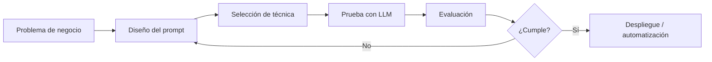

# Módulo: Científico de Datos e Inteligencia Artificial Aplicada

## Unidad 2: NLP y el Auge de la IA Generativa (LLMs)
## Clase 3: IA Generativa y Prompt Engineering

---

> **Duración estimada:** 4 a 6 horas presenciales  
> **Prerrequisito:** Clase 2 — La Revolución de los Transformers  
> **Material práctico:** carpeta `Clase-03-IA-Generativa-y-Prompt-Engineering/notebooks/`

---

## 1. Introducción — De entender texto a generar soluciones

En la Clase 1 aprendiste a convertir texto en números. En la Clase 2 descubriste cómo los Transformers y los LLMs predicen el siguiente token. Ahora llega la pregunta que todo profesional de datos se hace en 2025:

**¿Cómo saco valor real de un LLM sin entrenarlo desde cero?**

La respuesta es **Prompt Engineering**: el arte y la ciencia de comunicarte con un modelo de lenguaje para obtener respuestas útiles, precisas y controladas. No necesitas millones de dólares en GPU ni un doctorado en ML para automatizar resúmenes, clasificar tickets, generar código o asistir a clientes. Necesitas **saber qué pedirle al modelo y cómo pedirlo**.

Esta clase es **80% práctica**: diseñarás prompts en español, los probarás en vivo con **GPT-2 Spanish**, compararás estrategias y resolverás un caso empresarial completo.



---

## 2. Objetivos de aprendizaje

Al finalizar esta clase, el estudiante será capaz de:

1. Diferenciar IA tradicional (discriminativa) de IA generativa con ejemplos concretos.
2. Explicar qué es un LLM, cómo funciona GPT/Llama/Gemini/Mistral y cuáles son sus límites.
3. Diseñar prompts estructurados con rol, contexto, instrucción, restricciones y formato de salida.
4. Aplicar técnicas de prompting: zero-shot, one-shot, few-shot, Chain-of-Thought, role y context.
5. Optimizar prompts para mejorar precisión y reducir alucinaciones.
6. Resolver tareas prácticas: generación de código, contenido, resumen, traducción y análisis.
7. Comparar estrategias de prompting con métricas simples y criterios de calidad.
8. Completar un laboratorio integrador de diseño y evaluación de prompts.

---

## 3. Introducción a la IA Generativa

### ¿Qué es la Inteligencia Artificial Generativa?

La **IA Generativa** crea contenido nuevo (texto, imágenes, código, audio) a partir de patrones aprendidos en datos de entrenamiento. A diferencia de un clasificador que solo asigna etiquetas, un modelo generativo **produce** secuencias originales token por token.

| Aspecto | IA Tradicional (Discriminativa) | IA Generativa |
|---|---|---|
| Pregunta que responde | "¿A qué categoría pertenece?" | "¿Qué texto debería seguir?" |
| Salida | Etiqueta, probabilidad, score | Texto, imagen, código, audio |
| Ejemplos | Spam detector, clasificador de sentimiento | ChatGPT, DALL-E, Copilot |
| Entrenamiento | Aprende fronteras entre clases | Aprende distribución de datos |
| Flexibilidad | Una tarea por modelo | Múltiples tareas con un solo prompt |

### Casos de uso actuales

| Sector | Caso de uso | Técnica principal |
|---|---|---|
| Finanzas | Resumen de reportes trimestrales | Context prompting + restricciones |
| Salud | Borrador de notas clínicas (con revisión humana) | Role prompting + formato estructurado |
| Legal | Extracción y resumen de cláusulas | Few-shot + CoT |
| E-commerce | Descripciones de producto | Zero-shot + tono de marca |
| Soporte | Respuestas automáticas a tickets | Few-shot + context del ticket |
| Educación | Tutoría personalizada | Role prompting + CoT |
| Marketing | Copy para campañas | Role + restricciones de longitud |
| Desarrollo | Generación y explicación de código | Few-shot + formato de salida |

> **Nota para el docente:** Preguntar: *"¿Qué tarea de su trabajo actual podrían automatizar con un LLM sin entrenar un modelo nuevo?"*. Anotar 3-5 respuestas en pizarra.

---

## 4. Modelos de Lenguaje de Gran Escala (LLMs)

### ¿Qué es un LLM?

Un **Large Language Model** es un Transformer decoder-only (o variante) entrenado con enormes corpus de texto para predecir el siguiente token. Escala = miles de millones de parámetros + terabytes de datos + semanas de GPU.

### Funcionamiento general

```
Prompt: "Traduce al inglés: Hola mundo"
         ↓
    [Tokenización]
         ↓
    [Embeddings + Positional Encoding]
         ↓
    [Capas Transformer × N]
         ↓
    [Predicción del siguiente token]
         ↓
    "Hello" → " world" → [FIN]
```

### Comparación rápida de modelos

| Modelo | Empresa | Tipo | Fortaleza | Acceso |
|---|---|---|---|---|
| GPT-4 / ChatGPT | OpenAI | Decoder-only | Razonamiento, versatilidad | API (de pago) |
| Claude | Anthropic | Decoder-only | Contexto largo, análisis | API |
| Gemini | Google | Decoder-only multimodal | Integración Google | API |
| Llama 3 | Meta | Decoder-only | Open weights, on-premise | Descarga libre |
| Mistral | Mistral AI | Decoder-only | Eficiencia, Europa | Open weights |
| GPT-2 Spanish | Datificate | Decoder-only | Educativo, español | Hugging Face |
| Robertuito | pysentimiento | Encoder-only | Sentimiento en español | Hugging Face |
| BERT QA ES | mrm8488 | Encoder-only | Preguntas y respuestas | Hugging Face |

### Capacidades

- Generación de texto coherente en múltiples idiomas.
- Resumen, traducción, parafraseo zero-shot.
- Razonamiento con Chain-of-Thought.
- Generación de código con contexto.
- Seguir instrucciones (modelos alineados con RLHF).

### Limitaciones

| Limitación | Descripción | Mitigación |
|---|---|---|
| Alucinaciones | Inventa hechos con tono convincente | Restricciones, citar fuentes, verificación humana |
| Conocimiento desactualizado | Datos de entrenamiento con fecha de corte | RAG (Clase siguiente), búsqueda web |
| Context window | No procesa documentos infinitos | Chunking, resumen iterativo |
| Sesgos | Refleja sesgos del corpus de entrenamiento | Filtros, prompts de neutralidad |
| Costo y latencia | Modelos grandes son caros y lentos | Modelos pequeños, caching, batching |
| Inconsistencia | Misma pregunta → respuestas distintas | Temperatura baja, semilla fija |

> **Nota para el docente:** Abrir notebook `01_IA_Generativa_y_LLMs.ipynb`. Demostrar que GPT-2 Spanish "alucina" si le pides datos específicos sin contexto.

---

## 5. Prompt Engineering

### Concepto

**Prompt Engineering** es el diseño sistemático de instrucciones (prompts) para guiar la salida de un LLM hacia un objetivo específico, sin modificar los pesos del modelo.

Piénsalo como la diferencia entre:
- Preguntarle a un experto: *"¿Qué opinas?"* (vago)
- Preguntarle: *"Como analista financiero, resume en 3 bullets los riesgos del siguiente párrafo, sin inventar cifras:"* (estructurado)

### Anatomía de un buen prompt

```
┌─────────────────────────────────────────┐
│  ROL (quién eres)                       │
│  "Eres un analista de datos senior..."  │
├─────────────────────────────────────────┤
│  CONTEXTO (información de fondo)        │
│  "La empresa vende software B2B..."     │
├─────────────────────────────────────────┤
│  INSTRUCCIÓN (qué hacer)               │
│  "Clasifica el siguiente ticket..."     │
├─────────────────────────────────────────┤
│  RESTRICCIONES (qué NO hacer)           │
│  "No inventes datos. Máximo 50 palabras"│
├─────────────────────────────────────────┤
│  FORMATO DE SALIDA (cómo responder)     │
│  "Responde en JSON: {categoria, urgencia}"│
├─────────────────────────────────────────┤
│  EJEMPLOS (few-shot, opcional)          │
│  "Ejemplo 1: ... → Resultado: ..."      │
├─────────────────────────────────────────┤
│  ENTRADA (el dato a procesar)           │
│  "Ticket: No puedo acceder al sistema"  │
└─────────────────────────────────────────┘
```

### Buenas prácticas

1. **Sé específico:** "Resume en 3 oraciones" > "Resume esto".
2. **Define el formato:** JSON, bullets, tabla, código.
3. **Da contexto suficiente:** el modelo no lee tu mente.
4. **Usa delimitadores:** `"""`, `---`, `<contexto>` para separar secciones.
5. **Indica el tono:** formal, técnico, amigable, conciso.
6. **Pide paso a paso** cuando la tarea es compleja (CoT).
7. **Itera:** el primer prompt rara vez es el definitivo.
8. **Evalúa con criterios:** no confíes en la primera respuesta "bonita".

### Malos vs buenos prompts

| Malo | Bueno | Por qué |
|---|---|---|
| "Analiza esto" | "Clasifica como positivo/negativo/neutral. Solo la etiqueta." | Instrucción clara y salida acotada |
| "Escribe sobre IA" | "Escribe 100 palabras sobre IA en educación, tono divulgativo, 3 párrafos" | Longitud, tema y tono definidos |
| "Traduce" | "Traduce del español al inglés. Mantén nombres propios. Solo la traducción:" | Idiomas, reglas y formato |
| "Dame datos de ventas" | "Según el contexto abajo, ¿cuál fue la venta de Q3? Si no está, responde 'No disponible'." | Evita alucinaciones |

> **Nota para el docente:** Notebook `02_Anatomia_del_Prompt.ipynb`. Ejercicio en vivo: cada estudiante escribe un prompt malo y otro lo mejora en 2 minutos.

---

## 6. Técnicas de Prompting

### Zero-shot Prompting

Sin ejemplos. Solo instrucción directa.

```
Clasifica el sentimiento como positivo, negativo o neutral:
Texto: "El producto llegó roto y nadie respondió."
Sentimiento:
```

**Cuándo usar:** tareas simples y bien definidas que el modelo ya conoce.

### One-shot Prompting

Un ejemplo antes de la tarea real.

```
Traduce al inglés:
Español: "Buenos días"
Inglés: "Good morning"

Español: "Gracias por su compra"
Inglés:
```

**Cuándo usar:** cuando el formato o estilo no es obvio.

### Few-shot Prompting

Varios ejemplos (típicamente 2-5).

```
Clasifica urgencia (alta/media/baja):

Ticket: "Sistema caído, no puedo facturar" → alta
Ticket: "¿Cómo cambio mi contraseña?" → baja
Ticket: "Error intermitente en reportes" → media

Ticket: "No recibí mi pedido después de 2 semanas" →
```

**Cuándo usar:** tareas con categorías propias de tu empresa o formato específico.

### Chain-of-Thought (CoT)

Pide razonamiento paso a paso antes de la respuesta final.

```
Un restaurante tiene 23 manzanas. Usan 20 para pasteles y compran 6 más.
Piensa paso a paso: ¿cuántas manzanas tienen?

Razonamiento:
```

**Cuándo usar:** matemáticas, lógica, decisiones multi-paso. Mejora precisión en tareas complejas.

### Role Prompting

Asigna un rol o persona al modelo.

```
Eres un abogado laboral colombiano con 15 años de experiencia.
Explica en lenguaje simple qué significa "justa causa" en un contrato.
```

**Cuándo usar:** cuando necesitas expertise, tono o perspectiva específica.

### Context Prompting

Proporciona documentos o datos como contexto.

```
<contexto>
Política de devoluciones: 30 días, producto sin usar, con factura.
</contexto>

Pregunta del cliente: "Compré hace 3 semanas, ¿puedo devolver?"
Respuesta basada SOLO en el contexto:
```

**Cuándo usar:** QA sobre documentos, soporte con base de conocimiento, análisis de contratos.

> **Nota para el docente:** Notebook `03_Tecnicas_Prompting.ipynb`. Demo comparativa: misma tarea con zero-shot vs few-shot vs CoT.

---

## 7. Optimización de Prompts

### Cómo mejorar la precisión

| Técnica | Acción | Ejemplo |
|---|---|---|
| Especificidad | Acotar la tarea | "3 bullets" en vez de "resume" |
| Descomposición | Dividir tareas complejas | Paso 1: extraer → Paso 2: clasificar |
| Formato forzado | Salida estructurada | "Responde SOLO con: SI o NO" |
| Validación | Pedir auto-verificación | "Revisa tu respuesta antes de responder" |
| Temperatura | Bajar para tareas factuales | T=0.1 para clasificación; T=0.8 para creatividad |

### Reducción de alucinaciones

1. **Instrucción explícita:** "Si no encuentras la respuesta en el contexto, di 'No disponible'."
2. **Citar fuentes:** "Indica de qué parte del contexto sacaste cada dato."
3. **Restricción de conocimiento:** "Responde SOLO con la información proporcionada."
4. **Verificación externa:** Humano en el loop para datos críticos.
5. **Temperatura baja:** Menos creatividad = menos invención.

### Uso de restricciones e instrucciones específicas

```
INSTRUCCIONES:
- Máximo 100 palabras
- Tono profesional
- No uses jerga técnica
- No inventes cifras ni fechas
- Si falta información, indícalo explícitamente
- Formato: 3 viñetas con guión
```

> **Nota para el docente:** Notebook `04_Optimizacion_Prompts.ipynb`. Experimento: mismo documento con prompt sin restricciones vs con restricciones anti-alucinación.

---

## 8. Aplicaciones prácticas

| Aplicación | Técnica recomendada | Prompt clave |
|---|---|---|
| Generación de código | Few-shot + formato | "Genera función Python que... Solo código, sin explicación" |
| Creación de contenido | Role + restricciones | "Eres copywriter. 150 palabras, tono juvenil, CTA al final" |
| Resumen de documentos | Context + formato | "Resume en 5 bullets. Solo hechos del texto." |
| Traducción | One-shot + restricciones | "Traduce manteniendo nombres propios. Solo traducción:" |
| Análisis de texto | Zero-shot o few-shot | "Extrae: sentimiento, tema, urgencia. Formato JSON." |
| Automatización de tareas | CoT + formato | "Paso 1: identifica... Paso 2: clasifica... Paso 3: responde..." |

> **Nota para el docente:** Notebook `05_Aplicaciones_Practicas.ipynb`. Cada estudiante elige una aplicación y diseña su prompt.

---

## 9. Material para el docente — Guía de sesión (4-6 horas)

| Bloque | Tiempo | Actividad | Material |
|---|---|---|---|
| 1. IA Generativa y LLMs | 45 min | Conceptos + demo GPT-2 Spanish | README §3-4, Notebook 01 |
| 2. Anatomía del prompt | 45 min | Diseño guiado + ejercicio en parejas | README §5, Notebook 02 |
| 3. Técnicas de prompting | 60 min | Zero/one/few-shot, CoT, role, context | README §6, Notebook 03 |
| **Descanso** | 15 min | | |
| 4. Optimización | 45 min | Anti-alucinaciones + restricciones | README §7, Notebook 04 |
| 5. Aplicaciones prácticas | 45 min | 6 casos hands-on | Notebook 05 |
| 6. Comparación de estrategias | 45 min | Tabla comparativa + debate | Notebook 06 |
| 7. Laboratorio final | 60 min | Caso empresarial integrador | Notebook 07 + PromptEngineering_Lab |

**Puntos de pausa recomendados:**

- Después de §3: *"¿Qué diferencia hay entre el clasificador de la Clase 1 y ChatGPT?"*
- Después de §5: *"Escriban un prompt malo y mejórenlo en 2 minutos."*
- Después de §6: *"¿Cuándo usarían CoT vs few-shot?"*
- Después de §7: *"¿Cómo verificarían que el LLM no alucina en producción?"*
- Cierre: *"¿Qué prompt llevarían a su trabajo el lunes?"*

---

## 10. Actividad final — PromptEngineering Lab

Proyecto integrador (misma estructura que MiniChatGPT Lab de la Clase 2):

```text
clase_03_ia_generativa_prompt_engineering/PromptEngineering_Lab/
├── README.md
├── requirements.txt
├── notebooks/actividad.ipynb
├── src/
│   ├── prompt_builder.py
│   ├── strategies.py
│   ├── llm_client.py
│   ├── evaluator.py
│   └── utils.py
├── datasets/
└── images/
```

**Concepto:** laboratorio de diseño, prueba y comparación de prompts con modelos en español (GPT-2 Spanish + Robertuito).

| Parte | Contenido |
|---|---|
| 1 | Cargar LLM y entender el pipeline |
| 2 | Diseñar prompts con anatomía completa |
| 3 | Probar zero-shot, one-shot, few-shot |
| 4 | Chain-of-Thought y role prompting |
| 5 | Context prompting con documentos |
| 6 | Comparar estrategias con tabla de resultados |
| 7 | Caso práctico: asistente de soporte empresarial |

**Ejecución:**

```bash
cd PromptEngineering_Lab
pip install -r requirements.txt
jupyter notebook notebooks/actividad.ipynb
```

Ver rúbrica completa en `PromptEngineering_Lab/README.md`.

---

## Ejercicios guiados (con solución)

### Ejercicio 1: Zero-shot vs Few-shot

**Enunciado:** Clasificar tickets de soporte con ambas técnicas y comparar.

**Solución:** Ver Notebook 03, sección 3.

### Ejercicio 2: Chain-of-Thought

**Enunciado:** Resolver un problema lógico con y sin CoT.

**Solución:** Ver Notebook 03, sección 5.

### Ejercicio 3: Anti-alucinación

**Enunciado:** Preguntar datos que NO están en el contexto y verificar que el modelo responde "No disponible".

**Solución:** Ver Notebook 04, sección 3.

### Ejercicio 4: Role Prompting

**Enunciado:** Misma pregunta con 3 roles distintos (tutor, abogado, marketer).

**Solución:** Ver Notebook 03, sección 6.

### Ejercicio 5: Caso integrador

**Enunciado:** Diseñar un asistente de soporte con context prompting para una empresa ficticia.

**Solución:** Ver Notebook 07 y PromptEngineering_Lab.

---

## Ejercicios propuestos (sin resolver)

1. Diseña un prompt few-shot con 3 ejemplos para clasificar emails como "urgente/normal/spam".
2. Crea un prompt CoT para calcular el ROI de una campaña de marketing con datos ficticios.
3. Escribe un prompt con restricciones anti-alucinación para resumir contratos legales.
4. Compara la salida de GPT-2 con temperatura 0.2 vs 1.0 en la misma tarea creativa.
5. Diseña un prompt de generación de código que incluya manejo de errores.
6. Crea un prompt multilingüe (español → inglés → francés) con one-shot.
7. Evalúa 5 prompts distintos con una rúbrica de 1-5 en claridad, precisión y formato.
8. Investiga qué es "prompt injection" y escribe un prompt defensivo para un chatbot.
9. Diseña un flujo de 3 prompts encadenados: extraer → analizar → responder.
10. Propón un caso de uso de prompt engineering en tu industria con justificación técnica.

---

## Referencias

- OpenAI Prompt Engineering Guide: [https://platform.openai.com/docs/guides/prompt-engineering](https://platform.openai.com/docs/guides/prompt-engineering)
- Anthropic Prompt Library: [https://docs.anthropic.com/en/prompt-library](https://docs.anthropic.com/en/prompt-library)
- Google AI Prompting Guide: [https://ai.google.dev/gemini-api/docs/prompting-intro](https://ai.google.dev/gemini-api/docs/prompting-intro)
- Hugging Face LLM Course: [https://huggingface.co/learn/nlp-course](https://huggingface.co/learn/nlp-course)
- Wei et al. (2022). *Chain-of-Thought Prompting Elicits Reasoning in Large Language Models*
- Brown et al. (2020). *Language Models are Few-Shot Learners* (GPT-3 paper)
- OpenAI Cookbook: [https://cookbook.openai.com/](https://cookbook.openai.com/)

---

## Preparación para la siguiente clase

### Próximo tema: Aplicaciones con Hugging Face y despliegue

1. **Pipelines de Hugging Face** para tareas de NLP
2. **Fine-tuning con LoRA/QLoRA**
3. **RAG (Retrieval-Augmented Generation)**
4. **Evaluación y despliegue de LLMs**

### Preguntas de puente

- ¿Cuándo conviene prompt engineering vs fine-tuning?
- ¿Cómo escalarías un sistema de prompts a 1000 usuarios diarios?
- ¿Qué métricas usarías para evaluar calidad de prompts en producción?

---

## Resumen de conceptos

| Concepto | Idea clave | Técnica principal | Riesgo frecuente |
|---|---|---|---|
| IA Generativa | Crea contenido nuevo | LLM autoregresivo | Contenido incorrecto o sesgado |
| LLM | Transformer a escala masiva | Predicción de siguiente token | Alucinaciones, costo |
| Prompt Engineering | Guiar al modelo con instrucciones | Diseño iterativo de prompts | Prompt vago → respuesta vaga |
| Zero-shot | Sin ejemplos | Instrucción directa | Baja precisión en tareas raras |
| Few-shot | Con ejemplos | 2-5 demos en el prompt | Ejemplos malos → salida mala |
| Chain-of-Thought | Razonamiento paso a paso | "Piensa paso a paso" | Más tokens = más costo |
| Role Prompting | Asignar persona/expertise | "Eres un experto en..." | Rol sin restricciones |
| Context Prompting | Dar documentos de referencia | Delimitadores + contexto | Contexto demasiado largo |
| Anti-alucinación | Evitar invención de datos | "Solo usa el contexto dado" | Falsa sensación de verdad |

---
