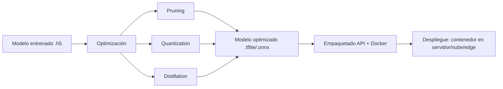

# Módulo: Científico de Datos e Inteligencia Artificial Aplicada

## Unidad 3: IA Aplicada, Databricks y Arquitecturas Modernas
## Clase 2: Optimización y Despliegue de Deep Learning

---

> **Duración estimada:** 4 a 6 horas presenciales
> **Prerrequisito:** Clase 1 — Sistemas de Recomendación y Aprendizaje por Refuerzo, y Unidad 1 (fundamentos de redes neuronales con TensorFlow/Keras)
> **Material práctico:** carpetas `proyecto_01_optimizacion_modelo/`, `proyecto_02_api_fastapi_docker/` y `proyecto_03_benchmark_integrador/`
> **Material de apoyo:** `teoria/index.html` (versión navegable de esta teoría)

---

## 1. Introducción — de notebook a producción

Entrenar un modelo en un notebook y tenerlo funcionando de forma confiable dentro de un producto son dos problemas distintos. Un modelo entrenado en Keras puede pesar cientos de megabytes, tardar segundos en responder y necesitar una GPU para ser rápido. En producción casi nunca tenemos ese lujo: la inferencia debe correr en milisegundos, muchas veces en CPU, a veces en un teléfono o un dispositivo con memoria limitada, y siempre dentro de un presupuesto de infraestructura.

Esta clase cubre el puente entre "el modelo funciona" y "el modelo está desplegado": cómo hacerlo más pequeño y rápido sin destruir su precisión (**optimización**), y cómo empaquetarlo para que otros sistemas puedan consumirlo de forma confiable (**despliegue**).



---

## 2. Objetivos de aprendizaje

Al finalizar esta clase, el estudiante será capaz de:

1. Explicar por qué un modelo entrenado no está listo para producción tal cual.
2. Aplicar **pruning** para reducir parámetros irrelevantes de una red.
3. Aplicar **quantization** post-entrenamiento (dinámica, float16, entera) y explicar sus trade-offs.
4. Explicar **knowledge distillation** como alternativa para obtener modelos pequeños.
5. Convertir un modelo Keras a formatos de despliegue: **TFLite** y **ONNX**.
6. Diseñar una **API REST** con FastAPI que sirva un modelo de Deep Learning.
7. Empaquetar esa API en una **imagen Docker** siguiendo buenas prácticas.
8. Conectarse a un servidor remoto por **SSH** y explicar por qué es la base del despliegue seguro.
9. Separar configuración y credenciales del código fuente usando archivos **`.env`**.
10. Medir y comparar **latencia, tamaño y precisión** entre un modelo base y uno optimizado.
11. Orquestar dos servicios con **docker-compose** para comparar despliegues en paralelo.

---

## 3. El problema de llevar un modelo a producción

| Restricción | En el notebook | En producción |
|---|---|---|
| Hardware | GPU dedicada, sin límite de tiempo | CPU compartida, presupuesto de milisegundos |
| Tamaño del modelo | Irrelevante | Afecta tiempo de arranque, memoria, costo de imagen |
| Latencia | No se mide | Es un SLA: p95 < 200ms, por ejemplo |
| Concurrencia | Una petición a la vez | Cientos o miles de peticiones simultáneas |
| Reproducibilidad | El notebook "funciona en mi máquina" | Debe funcionar igual en cualquier entorno (Docker) |
| Actualización | Reentrenar y listo | Versionado, rollback, monitoreo |

**Analogía:** entrenar un modelo es como cocinar un plato gourmet en tu cocina con todo el tiempo del mundo. Desplegarlo es como servir ese mismo plato en un restaurante de comida rápida: debe salir en segundos, con ingredientes optimizados, y ser consistente en cada pedido.

> **Nota para el docente:** detener aquí 10 minutos y preguntar: *"¿Qué pasaría si el modelo de reconocimiento facial de un celular tardara 3 segundos en responder?"*. Conectar con la necesidad de optimización.

---

## 4. Técnicas de optimización de modelos

### 4.1 Pruning (poda de parámetros)

Una red neuronal entrenada suele tener muchos pesos con valores cercanos a cero que aportan poco a la predicción final. El **pruning** identifica y elimina (pone en cero) esas conexiones, generando una red más dispersa (*sparse*) que puede comprimirse y, en algunos runtimes, ejecutarse más rápido.

```
Red densa:            Red podada (pruning):
●───●───●              ●───●───●
│╲ ╱│╲ ╱│              │   │   │
│ ╳ │ ╳ │      →       │   │   │
│╱ ╲│╱ ╲│              │   │   │
●───●───●              ●───●───●
(todas las conexiones)  (solo conexiones relevantes)
```

- **Magnitude pruning:** elimina los pesos con menor valor absoluto.
- **Structured pruning:** elimina neuronas o filtros completos (más fácil de acelerar en hardware estándar).
- **Pruning gradual durante entrenamiento** (usado en `tensorflow-model-optimization`): aumenta la dispersión progresivamente mientras el modelo sigue aprendiendo, para minimizar pérdida de precisión.

**Trade-off:** más pruning = modelo más pequeño y disperso, pero con riesgo creciente de pérdida de precisión si se poda demasiado agresivo.

### 4.2 Quantization (cuantización)

Un modelo Keras estándar guarda sus pesos en **float32** (32 bits por número). La cuantización representa esos pesos con menor precisión numérica, reduciendo tamaño y, en muchos casos, acelerando la inferencia en CPU.

| Tipo | Precisión de pesos | Reducción típica de tamaño | Cuándo usarla |
|---|---|---|---|
| **Dynamic range quantization** | int8 en pesos, float32 en activaciones (se calculan en runtime) | ~4x | Punto de partida rápido, sin dataset de calibración |
| **Float16 quantization** | float16 | ~2x | GPUs/hardware con soporte float16, mínima pérdida de precisión |
| **Full integer quantization (int8)** | int8 en pesos y activaciones | ~4x, más rápido en CPU/edge | Microcontroladores, TFLite en móviles, requiere dataset representativo para calibrar |
| **Quantization-aware training (QAT)** | int8 simulado durante entrenamiento | ~4x con menor pérdida de precisión que post-training | Cuando la cuantización post-entrenamiento degrada demasiado la precisión |

**Analogía:** es como comprimir una foto de alta resolución a JPEG. Pierdes algo de detalle, pero el archivo pesa una fracción del original y para el ojo humano (o para la tarea de clasificación) la diferencia es casi imperceptible.

En esta clase usamos **post-training dynamic range quantization** por ser la técnica más simple y con mejor relación esfuerzo/beneficio para empezar (ver `proyecto_01_optimizacion_modelo/`).

### 4.3 Knowledge Distillation

En lugar de comprimir el mismo modelo, se entrena una red pequeña (**student**) para imitar las predicciones de una red grande ya entrenada (**teacher**). El student aprende no solo de las etiquetas verdaderas, sino de la distribución de probabilidades completa que produce el teacher (*soft labels*), que contiene información adicional sobre qué tan "parecidas" son las clases entre sí.

```
Teacher (modelo grande, ya entrenado)
        │
        │ predicciones "suaves" (soft labels)
        ▼
Student (modelo pequeño, se entrena desde cero)
        │
        ▼
Modelo pequeño con desempeño cercano al teacher
```

**Cuándo usarla:** cuando se necesita un modelo drásticamente más pequeño (ej. de 100M a 5M parámetros) y se dispone de tiempo para un entrenamiento adicional. Es más costosa de implementar que pruning o quantization, por lo que no se desarrolla en el laboratorio práctico de esta clase, pero es importante conocerla.

### 4.4 Comparación resumen

| Técnica | Reduce tamaño | Reduce latencia | Requiere reentrenar | Complejidad de implementación |
|---|---|---|---|---|
| Pruning | Sí | A veces (según runtime) | Recomendado (fine-tuning) | Media |
| Quantization post-training | Sí | Sí | No | Baja |
| Quantization-aware training | Sí | Sí | Sí | Media-alta |
| Knowledge Distillation | Sí (mucho) | Sí | Sí, desde cero | Alta |

---

## 5. Formatos de modelo para despliegue

| Formato | Origen | Ventajas | Uso típico |
|---|---|---|---|
| **SavedModel** | TensorFlow nativo | Completo, incluye grafo y pesos | Servir con TensorFlow Serving |
| **HDF5 (.h5)** | Keras | Simple, legado | Prototipado, no recomendado para producción nueva |
| **TFLite (.tflite)** | Conversión desde TF/Keras | Muy liviano, soporta quantization nativa | Móviles, edge, microservicios livianos |
| **ONNX (.onnx)** | Estándar abierto interoperable | Portable entre frameworks (TF, PyTorch, scikit-learn) y runtimes (ONNX Runtime, TensorRT) | Cuando el modelo debe ejecutarse fuera del ecosistema TensorFlow |

**¿Por qué no servir directamente el `.h5` en producción?** Porque acopla el servicio a tener TensorFlow completo instalado (cientos de MB), con inicialización más lenta y sin las optimizaciones de un runtime especializado en inferencia.

En el laboratorio práctico convertimos el modelo entrenado a **TFLite** con quantization dinámica, por ser el camino más directo desde Keras y el más liviano para una API en Docker.

---

## 6. Patrones de despliegue

| Patrón | Descripción | Ejemplo |
|---|---|---|
| **Batch inference** | El modelo procesa grandes volúmenes de datos de forma periódica, sin respuesta inmediata | Scoring nocturno de riesgo crediticio |
| **Online / real-time (REST API)** | El modelo responde a peticiones individuales en tiempo real | Clasificación de imágenes al subir una foto |
| **Edge deployment** | El modelo corre directamente en el dispositivo del usuario, sin red | Reconocimiento facial en un celular sin conexión |
| **Streaming** | El modelo procesa eventos continuos de un stream de datos | Detección de fraude en transacciones en vivo |

Esta clase se enfoca en el patrón **online / REST API empaquetada en Docker**, el más común para exponer un modelo como servicio dentro de una arquitectura de microservicios.

---

## 7. FastAPI para servir modelos

**FastAPI** es un framework de Python para construir APIs, elegido para servir modelos por tres razones prácticas: es rápido (basado en Starlette y Pydantic), genera documentación interactiva automática (`/docs`), y valida los datos de entrada/salida con tipado declarativo.

Esqueleto mínimo de una API de inferencia:

```python
from fastapi import FastAPI
from pydantic import BaseModel

app = FastAPI(title="Servicio de inferencia")

class PredictionRequest(BaseModel):
    image: list  # matriz de píxeles normalizada

@app.get("/health")
def health():
    return {"status": "ok"}

@app.post("/predict")
def predict(request: PredictionRequest):
    # cargar modelo (una sola vez, al iniciar la app)
    # ejecutar inferencia
    # devolver clase predicha y probabilidad
    return {"clase": "sneaker", "confianza": 0.94}
```

**Buenas prácticas:**

- Cargar el modelo **una sola vez** al iniciar la aplicación (no en cada petición).
- Separar la lógica de preprocesamiento/inferencia (`model_utils.py`) de la definición de endpoints (`main.py`).
- Validar entradas con Pydantic para evitar errores silenciosos.
- Exponer un endpoint `/health` para que orquestadores (Docker, Kubernetes) verifiquen que el servicio está vivo.

Ver implementación completa en `proyecto_02_api_fastapi_docker/`.

---

## 8. Docker para IA

### 8.1 Conceptos clave

| Concepto | Definición |
|---|---|
| **Imagen** | Plantilla inmutable con el sistema, dependencias y código de la aplicación |
| **Contenedor** | Instancia en ejecución de una imagen |
| **Dockerfile** | Receta de instrucciones para construir una imagen |
| **Registry** | Repositorio donde se almacenan y versionan imágenes (Docker Hub, ECR, GCR) |

**Analogía:** la imagen es como la receta de cocina impresa y estandarizada; el contenedor es el plato ya servido a partir de esa receta. Puedes servir el mismo plato mil veces, en mil cocinas distintas, y siempre sale igual.

### 8.2 Dockerfile típico para una API de inferencia

```dockerfile
FROM python:3.11-slim

WORKDIR /app

COPY requirements.txt .
RUN pip install --no-cache-dir -r requirements.txt

COPY app/ ./app
COPY model/ ./model

EXPOSE 8000

CMD ["uvicorn", "app.main:app", "--host", "0.0.0.0", "--port", "8000"]
```

### 8.3 Buenas prácticas

- Usar imágenes base **slim** (menos superficie de ataque, builds más rápidos).
- Copiar `requirements.txt` **antes** que el código, para aprovechar el caché de capas de Docker.
- No incluir el proceso de entrenamiento dentro de la imagen de servicio: la imagen de producción solo debe contener el modelo ya optimizado y el código de inferencia.
- Definir `.dockerignore` para excluir notebooks, datasets y archivos innecesarios de la imagen.
- Fijar versiones en `requirements.txt` para builds reproducibles.

Ver `Dockerfile` completos y funcionales en `proyecto_02_api_fastapi_docker/` y `proyecto_03_benchmark_integrador/`.

---

## 9. Acceso remoto seguro (SSH) y configuración con `.env`

Hasta aquí hemos optimizado el modelo y lo hemos empaquetado en una imagen Docker. Falta la pregunta obvia: **¿cómo llega esa imagen a un servidor real, y cómo evitamos que las credenciales terminen expuestas en el código?** Esta sección responde eso con dos herramientas que todo despliegue profesional usa: SSH y archivos `.env`.

### 9.1 SSH — la base del acceso remoto seguro

**SSH (Secure Shell)** es un protocolo que permite conectarse y ejecutar comandos en un servidor remoto de forma cifrada. Es, literalmente, la puerta de entrada a cualquier máquina en la nube: cuando alguien dice "me conecté al servidor y desplegué la app", casi siempre lo hizo por SSH.

**¿Por qué es tan importante en despliegue?**

- Es el mecanismo estándar para conectarte a instancias en la nube (AWS EC2, GCP Compute Engine, Azure VM, un droplet de DigitalOcean, un servidor on-premise).
- `git` usa SSH para autenticarse contra repositorios remotos sin pedir usuario/contraseña en cada `push`.
- `docker context` y muchas herramientas de CI/CD usan un túnel SSH para construir o desplegar contenedores en un host remoto.
- Permite copiar archivos de forma segura con `scp` o `rsync` (por ejemplo, subir el `.tflite` optimizado a un servidor).
- Sin SSH (o su equivalente cifrado), cualquier credencial o comando viajaría en texto plano por la red, visible para quien intercepte el tráfico.

**Cómo funciona (criptografía de llave pública):**

```
Tu máquina                              Servidor remoto
┌─────────────────┐                     ┌─────────────────┐
│ Llave PRIVADA    │   nunca viaja       │ Llave PÚBLICA    │
│ (id_ed25519)     │   por la red        │ (authorized_keys)│
└─────────────────┘                     └─────────────────┘
         │                                        │
         └──────── desafío cifrado ───────────────┘
                  (solo quien tiene la privada
                   puede responder correctamente)
```

**Analogía:** la llave pública es como un candado que le entregas al servidor para que lo instale en su puerta; la llave privada es la única llave que abre ese candado, y nunca sale de tu bolsillo. Cualquiera puede ver el candado, pero solo tú puedes abrirlo.

**Comandos esenciales:**

```bash
# Generar un par de llaves (una sola vez, en tu máquina)
ssh-keygen -t ed25519 -C "tu_correo@ejemplo.com"

# Copiar la llave pública al servidor (habilita el acceso sin contraseña)
ssh-copy-id usuario@servidor.ejemplo.com

# Conectarte
ssh usuario@servidor.ejemplo.com

# Copiar un archivo (por ejemplo, el modelo optimizado) al servidor
scp proyecto_01_optimizacion_modelo/models/modelo_optimizado.tflite usuario@servidor:/ruta/destino/

# Ejecutar un comando remoto sin abrir sesión interactiva
ssh usuario@servidor "docker compose up -d"
```

**Buenas prácticas:**

- Autenticarse siempre con **llaves**, nunca con contraseña (deshabilitar `PasswordAuthentication` en el servidor).
- Proteger la llave privada con una **passphrase** y nunca compartirla ni subirla a un repositorio.
- Usar `~/.ssh/config` para no repetir usuario/host/puerto en cada conexión:

```
Host servidor-produccion
    HostName 203.0.113.10
    User despliegue
    IdentityFile ~/.ssh/id_ed25519
```

- Rotar las llaves periódicamente y revocar el acceso (`authorized_keys`) cuando alguien deja el equipo.

> **Nota para el docente:** si hay tiempo, hacer una demo en vivo: `ssh-keygen`, mostrar el par de llaves generado, y explicar qué pasaría si la llave privada se subiera por error a un repositorio público de GitHub (buscar en vivo "GitHub secret scanning" para mostrar que GitHub detecta y alerta este tipo de fugas).

### 9.2 Archivos `.env` — separar configuración de código

Un `.env` es un archivo de texto plano con pares `CLAVE=valor` que contiene la **configuración específica de un entorno**: URLs, puertos, rutas de modelos, credenciales de bases de datos, API keys. La idea central es simple pero crítica: **el código nunca debe tener valores hardcodeados que cambien entre entornos o que sean secretos.**

```bash
# .env (ejemplo para el servicio de inferencia)
MODEL_PATH=/app/model/modelo_optimizado.tflite
LOG_LEVEL=INFO
API_KEY=sk-xxxxxxxxxxxxxxxx
MAX_BATCH_SIZE=32
```

**¿Por qué importa tanto?**

| Problema sin `.env` | Solución con `.env` |
|---|---|
| Credenciales hardcodeadas en el código, visibles en el historial de git | Los secretos viven fuera del repositorio |
| Un mismo `main.py` no sirve para dev/staging/producción | Cada entorno tiene su propio `.env` con las rutas/credenciales correctas |
| Cambiar un valor de configuración implica modificar y redeployar código | Cambiar el `.env` basta, sin tocar el código |
| Difícil rotar una API key filtrada | Se reemplaza el valor en el `.env` y se reinicia el servicio |

De hecho, el proyecto 2 de esta clase ya usa esta idea: `app/model_utils.py` lee la ruta del modelo con `os.environ.get("MODEL_PATH", ...)`, exactamente para poder sobreescribirla vía variable de entorno sin tocar el código.

**Uso típico en Python (`python-dotenv`):**

```python
from dotenv import load_dotenv
import os

load_dotenv()  # carga las variables del archivo .env al entorno del proceso

model_path = os.environ.get("MODEL_PATH", "model/modelo_optimizado.tflite")
```

**Uso con Docker:**

```bash
# Pasar el .env al contenedor sin copiarlo dentro de la imagen
docker run --env-file .env -p 8000:8000 clase02-inference-api
```

```yaml
# En docker-compose.yml
services:
  modelo-optimizado:
    build: ./servicio_optimizado
    env_file:
      - .env
```

**Regla de oro:** el archivo `.env` con valores reales **nunca se sube al repositorio**. Se agrega a `.gitignore` y, en su lugar, se versiona un `.env.example` con las claves esperadas pero sin valores sensibles:

```bash
# .env.example (sí se versiona)
MODEL_PATH=
LOG_LEVEL=INFO
API_KEY=
```

> **Nota para el docente:** conectar esta sección con la de Docker (§8): el `Dockerfile` construye la imagen (el "qué"), y el `.env` decide cómo se comporta esa misma imagen en cada entorno (el "cómo"). Preguntar: *"¿Por qué sería un error copiar el `.env` dentro de la imagen con `COPY .env .`?"* (respuesta esperada: la imagen quedaría atada a un solo entorno y los secretos quedarían embebidos en las capas de la imagen, visibles incluso si luego se borra el archivo).

---

## 10. Métricas de despliegue

| Métrica | Qué mide | Cómo se calcula en el laboratorio |
|---|---|---|
| **Tamaño del modelo** | Peso en disco del artefacto | `os.path.getsize()` sobre `.h5` vs `.tflite` |
| **Latencia** | Tiempo de una inferencia individual | Promedio de N llamadas cronometradas |
| **Throughput** | Peticiones atendidas por segundo | N peticiones / tiempo total |
| **Precisión (accuracy)** | Calidad de las predicciones | Comparación en el set de prueba antes/después de optimizar |

El objetivo nunca es optimizar a ciegas: siempre se compara **tamaño y latencia ganados** contra **precisión perdida**, y se decide si el trade-off es aceptable para el caso de negocio.

---

## 11. Laboratorios prácticos de esta clase

Esta clase tiene **tres mini-proyectos** progresivos, todos dentro de esta misma carpeta:

```text
clase_02_optimizacion_despliegue_dl/
├── README.md                          ← este archivo
├── teoria/
│   └── index.html                     ← teoría en formato navegable
├── proyecto_01_optimizacion_modelo/   ← entrena y optimiza (pruning + quantization + TFLite)
├── proyecto_02_api_fastapi_docker/    ← sirve el modelo optimizado con FastAPI + Docker
└── proyecto_03_benchmark_integrador/  ← compara modelo base vs optimizado con docker-compose
```

| Proyecto | Qué hace | Tecnologías | Entregable |
|---|---|---|---|
| **1. Optimización de modelo** | Entrena una CNN en Fashion-MNIST, aplica pruning y quantization, exporta a TFLite | TensorFlow, Keras, TensorFlow Model Optimization | Modelo `.h5` y `.tflite` + tabla comparativa de tamaño/precisión |
| **2. API + Docker** | Expone el modelo `.tflite` como servicio REST | FastAPI, TFLite Runtime, Docker | Imagen Docker funcional con endpoint `/predict` |
| **3. Benchmark integrador** | Levanta dos servicios (modelo base vs optimizado) con docker-compose y mide latencia/throughput | Docker Compose, FastAPI, `requests` | Reporte comparativo `benchmark/reporte.md` |

**Orden recomendado de ejecución:** proyecto 1 → proyecto 2 → proyecto 3, ya que cada uno consume los artefactos generados por el anterior.

> **Nota para el docente:** dedicar 90 minutos al proyecto 1 (entrenamiento + optimización), 90 minutos al proyecto 2 (API + Docker) y 60-90 minutos al proyecto 3 (benchmark comparativo), dejando el resto para discusión de resultados.

---

## 12. Ejercicios propuestos (sin resolver — para estudiantes)

1. Repetir la cuantización con **float16** en lugar de dynamic range y comparar tamaño/latencia contra la versión del laboratorio.
2. Aumentar el porcentaje de pruning (`final_sparsity`) a 0.7 y observar el impacto en `accuracy`.
3. Exportar el modelo optimizado también a **ONNX** con `tf2onnx` y comparar su tamaño contra el `.tflite`.
4. Añadir un endpoint `/predict_batch` en la API que acepte varias imágenes en una sola petición.
5. Modificar el `Dockerfile` del proyecto 2 para usar **multi-stage build** y comparar el tamaño final de la imagen.
6. En el proyecto 3, agregar un tercer servicio con el modelo podado (sin cuantizar) y comparar los tres escenarios.
7. Investigar qué es **TensorRT** y en qué escenarios reemplazaría a TFLite/ONNX Runtime.
8. Generar un par de llaves SSH (`ssh-keygen`) y configurar un archivo `~/.ssh/config` para una conexión ficticia.
9. Crear un `.env.example` para el proyecto 3 con todas las variables que usan `servicio_baseline` y `servicio_optimizado`, y modificar sus `main.py` para leer `LOG_LEVEL` desde el entorno.

---

## 13. Resumen de conceptos

| Concepto | Idea clave | Herramienta principal | Riesgo frecuente |
|---|---|---|---|
| Pruning | Elimina pesos poco relevantes | `tensorflow-model-optimization` | Podar demasiado y perder precisión |
| Quantization | Reduce precisión numérica de los pesos | `TFLiteConverter` | Asumir que siempre acelera en cualquier hardware |
| Knowledge Distillation | Modelo pequeño imita a uno grande | Entrenamiento custom con soft labels | Costo de entrenamiento adicional |
| TFLite / ONNX | Formatos livianos para inferencia | `tf.lite`, `tf2onnx`, `onnxruntime` | Elegir formato incompatible con el runtime destino |
| FastAPI | Expone el modelo como servicio REST | `fastapi`, `uvicorn` | Recargar el modelo en cada petición |
| Docker | Empaqueta el servicio de forma reproducible | `Dockerfile`, `docker-compose` | Imágenes pesadas por incluir dependencias de entrenamiento |
| SSH | Acceso remoto cifrado a servidores | `ssh`, `scp`, `ssh-keygen` | Autenticarse con contraseña en vez de llaves |
| `.env` | Separa configuración/secretos del código | `python-dotenv`, `--env-file`, `env_file` | Subir el `.env` real al repositorio |
| Benchmarking | Cuantifica el trade-off tamaño/latencia/precisión | Scripts propios con `time` | Optimizar sin medir el impacto en precisión |

---

## Referencias

- TensorFlow Model Optimization Toolkit: [https://www.tensorflow.org/model_optimization](https://www.tensorflow.org/model_optimization)
- TensorFlow Lite — Guía de conversión y quantization: [https://www.tensorflow.org/lite/performance/post_training_quantization](https://www.tensorflow.org/lite/performance/post_training_quantization)
- ONNX — Open Neural Network Exchange: [https://onnx.ai/](https://onnx.ai/)
- FastAPI — Documentación oficial: [https://fastapi.tiangolo.com/](https://fastapi.tiangolo.com/)
- Docker — Buenas prácticas para imágenes: [https://docs.docker.com/build/building/best-practices/](https://docs.docker.com/build/building/best-practices/)
- OpenSSH — Documentación oficial: [https://www.openssh.com/manual.html](https://www.openssh.com/manual.html)
- python-dotenv — Documentación: [https://saurabh-kumar.com/python-dotenv/](https://saurabh-kumar.com/python-dotenv/)
- The Twelve-Factor App — Config: [https://12factor.net/es/config](https://12factor.net/es/config)
- Hinton, Vinyals & Dean (2015). *Distilling the Knowledge in a Neural Network*.

---

## Preparación para la siguiente clase

### Próximo tema: Arquitecturas Modernas con Databricks

La siguiente sesión da un paso más allá del contenedor individual: cómo orquestar pipelines de datos y modelos a escala con Databricks y Apache Spark.

### Preguntas de puente

- Si tu API en Docker recibe 10,000 peticiones por segundo, ¿qué cambiaría en la arquitectura de despliegue?
- ¿Cómo versionarías distintas versiones de un modelo optimizado en producción?
- ¿Qué ventajas tendría mover el entrenamiento (no solo el despliegue) a una plataforma como Databricks?

---
