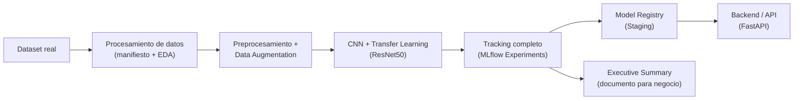

# Módulo: Científico de Datos e Inteligencia Artificial Aplicada

## Unidad 3: IA Aplicada, Databricks y Arquitecturas Modernas
## Clase 4: Laboratorio Práctico Dirigido (Proyecto Final Independiente)

---

> **Duración estimada:** 4 a 6 horas presenciales (el proyecto se completa como entrega
> asincrónica si no alcanza el tiempo en vivo -- ver sección 5).
> **Prerrequisito:** Clase 3 — Arquitecturas Modernas con Databricks (clusters, notebooks
> colaborativos, MLflow Tracking y Model Registry) y Unidad 1 (redes neuronales
> profundas, CNN y Transfer Learning).
> **Material práctico:** carpeta [`AI-XRay/`](AI-XRay/) (proyecto completo) y
> [`executive_summary/plantilla_executive_summary.docx`](executive_summary/plantilla_executive_summary.docx)
> **Cierre de unidad:** esta es la **última clase de la Unidad 3** y del módulo. El
> resultado de este laboratorio es la base directa del gran **Reto Real** que se
> resuelve más adelante en el máster.

---

## 1. Introducción — de "saber usar las piezas" a "construir el sistema completo"

En las tres clases anteriores de esta unidad se vieron piezas sueltas pero
fundamentales: cómo optimizar y desplegar un modelo (Clase 2), y cómo trabajar con
clusters, notebooks colaborativos y MLflow dentro de Databricks (Clase 3). En la
Unidad 1 se construyeron redes neuronales profundas, incluyendo CNN y Transfer
Learning.

Esta clase es distinta: **no se introduce una técnica nueva**. Es un **laboratorio
integrador**: todas esas piezas se ensamblan en un solo sistema, de punta a punta, tal
como se construiría en un equipo de IA real.

El docente **dicta** (guía en vivo, paso a paso) la construcción de **AI-XRay**: un
sistema de clasificación de radiografías de tórax pediátricas (NORMAL / PNEUMONIA) con
CNN + Transfer Learning. Inmediatamente después, **cada estudiante ejecuta su propia
instancia independiente** del mismo proyecto: sus propias corridas de MLflow, sus
propias variantes de hiperparámetros y su propio Executive Summary con sus propios
resultados. Lo "dirigido" está en que el docente define el sistema a construir; lo
"independiente" está en que cada quien lo ejecuta y decide por su cuenta.

> **Nota para el docente:** esta clase funciona mejor como *live coding* real, no como
> lectura de slides. El valor está en que el estudiante vea al docente enfrentarse a
> decisiones de arquitectura en tiempo real y luego repita ese proceso de decisión por
> su cuenta, con sus propias variantes.

---

## 2. Objetivos de aprendizaje

Al finalizar esta clase, el estudiante será capaz de:

1. Diseñar la arquitectura de un sistema de IA de punta a punta (datos → procesamiento
   → entrenamiento → tracking → registro → consumo).
2. Construir un manifiesto de datos y detectar problemas de calidad de datos reales
   (en este caso, fuga de información a nivel paciente) antes de entrenar cualquier
   modelo.
3. Entrenar un modelo de **CNN + Transfer Learning** (ResNet50) en dos fases: capas
   congeladas y fine-tuning.
4. Registrar el experimento completo en MLflow: parámetros, métricas, artefactos,
   *model signature* y comparación de múltiples runs.
5. Registrar, versionar y promover el modelo ganador en el **Model Registry**.
6. Servir el modelo entrenado con una **API REST** (FastAPI), sin necesidad de un
   frontend, siguiendo las buenas prácticas de la Clase 2 (modelo cargado una sola vez,
   validación de entradas, endpoint `/health`).
7. Redactar un **Executive Summary** que justifique técnicamente la arquitectura
   elegida y comunique el impacto de negocio a una audiencia no técnica.
8. Documentar las limitaciones reales de un sistema de IA aplicado a un dominio
   sensible (salud), incluyendo el aviso de que no reemplaza el diagnóstico médico.

---

## 3. El proyecto: AI-XRay

Todo el código, los notebooks, la API y la documentación técnica viven en la carpeta
[`AI-XRay/`](AI-XRay/), que es un proyecto completo y autocontenido. Su
[`README.md`](AI-XRay/README.md) es el documento técnico de referencia -- aquí solo se
resume lo esencial para la clase.

| Componente | Qué hace | Dónde está |
|---|---|---|
| Dataset | Pediatric Chest X-ray Pneumonia (Kaggle), 5,856 imágenes reales, ya descargado | `archive (2)/` (junto a esta carpeta) -- ver `AI-XRay/data/README.md` |
| Manifiesto + EDA | Construye el manifiesto, detecta fuga de datos a nivel paciente, arma el split propio y el subconjunto de 2,000 imágenes de la demo | `AI-XRay/notebooks/01_exploracion.ipynb` |
| Preprocesamiento | Pipeline `tf.data`: resize 224×224, `preprocess_input`, data augmentation | `AI-XRay/notebooks/02_preprocessing.ipynb` |
| Entrenamiento | 3 runs de referencia (2 con capas congeladas + 1 de fine-tuning), registrados en MLflow | `AI-XRay/notebooks/03_training.ipynb` |
| Evaluación y registro | Comparación de runs, registro y promoción del mejor modelo, export a `models/` | `AI-XRay/notebooks/04_evaluation.ipynb` |
| Backend / API | FastAPI: `POST /predict`, `GET /health`, documentación en `/docs` -- **sin frontend, sin contenedores** | `AI-XRay/api/` |
| Puente a Databricks | Cómo migraría cada etapa si el volumen de datos lo justificara (no se implementa, se documenta) | `AI-XRay/README.md`, sección "Fase 1 vs. Fase 2" |

**Por qué CNN + Transfer Learning (ResNet50) y no una DNN densa o un modelo de NLP:**
el dato de entrada es una imagen, así que la arquitectura natural es una red
convolucional; en vez de entrenar una CNN desde cero (poco viable con miles de
imágenes, no millones), se reutiliza ResNet50 preentrenada en ImageNet y se adapta el
clasificador al problema -- exactamente el mismo criterio de "elegir la arquitectura
según la naturaleza del dato" que se usaría para decidir entre una DNN tabular y un
modelo de NLP en otro proyecto.

**Fase 1 (local) primero, Fase 2 (Databricks) documentada, no implementada:** el reto
de esta clase pide "procesamiento masivo de datos en Databricks". AI-XRay cumple esto
con un paso simbólico en PySpark para el manifiesto (funciona igual con cientos de
miles de imágenes sobre un Data Lake real), pero el resto del sistema se construye
completo y funcional en local primero -- forzar un cluster de Databricks desde el día
uno, para ~2,000-6,000 imágenes, añadiría complejidad sin beneficio real. El mapa
completo de qué cambiaría al migrar está en `AI-XRay/README.md`, sección "Fase 1 vs.
Fase 2".

---

## 4. Registro completo del experimento en MLflow

Retomando y ampliando la Clase 3, cada run de AI-XRay registra:

| Elemento | Con qué se registra | Por qué importa |
|---|---|---|
| Parámetros | `mlflow.log_param()` | Responder "¿con qué configuración exacta se entrenó esta versión?" |
| Métricas por época | `mlflow.log_metrics(..., step=epoch)` | Ver la curva de entrenamiento, no solo el resultado final |
| Métricas finales | Accuracy, Precision, Recall, F1, ROC-AUC (nunca solo Accuracy) | En un problema médico desbalanceado, Accuracy sola puede ser engañosa |
| Artefactos | Matriz de confusión, curva ROC, curvas de entrenamiento, classification report | Auditoría visual sin re-ejecutar el notebook |
| El modelo | `mlflow.keras.log_model(..., signature=...)` | Poder cargarlo después sin el código de entrenamiento |
| Registro y stage | `mlflow.register_model()` + `transition_model_version_stage()` | Pasar de "experimento" a "candidato a producción" de forma controlada |

> **Nota para el docente:** vale la pena remarcar la diferencia entre *loguear un run*
> (cualquier intento, exitoso o no) y *registrar un modelo* (una decisión explícita:
> "este run es lo bastante bueno para versionarse"). Es el mismo criterio que aplica un
> equipo de MLOps en producción.

---

## 5. Estructura de la sesión

| Bloque | Qué hace el docente | Qué hace el estudiante | Tiempo sugerido |
|---|---|---|---|
| **1. Manifiesto y EDA** | Dicta `01_exploracion.ipynb` en vivo, remarcando la fuga de datos detectada | Sigue, ejecuta el notebook en paralelo | 45-60 min |
| **2. Preprocesamiento** | Dicta `02_preprocessing.ipynb`, explica `preprocess_input` vs. normalización 0-1 | Verifica visualmente su propio pipeline | 30-40 min |
| **3. Entrenamiento** | Dicta `03_training.ipynb`: los 3 runs de referencia | Corre los mismos runs (o variantes propias si el tiempo alcanza) | 90-120 min |
| **4. Evaluación y registro** | Dicta `04_evaluation.ipynb`: comparación, registro, promoción, export | Registra su propio mejor modelo | 30-45 min |
| **5. API** | Levanta la API con `uvicorn` y prueba `/predict` en `/docs` en vivo | Levanta su propia API con su modelo exportado | 20-30 min |
| **6. Executive Summary** | Explica la plantilla sección por sección con el ejemplo de AI-XRay | Redacta su propio Executive Summary con sus resultados reales | 40-60 min |

Si el tiempo de clase no alcanza para completar los 6 bloques, los últimos (entrenar
variantes propias, API, Executive Summary) quedan como entrega asincrónica -- ver
`AI-XRay/README.md`, sección "Cómo correrlo de principio a fin".

---

## 6. Requisitos y rúbrica de autoevaluación

Cada estudiante entrega su propia instancia de AI-XRay con:

1. **Manifiesto propio** generado con `01_exploracion.ipynb`, con la verificación de
   fuga de datos ejecutada (no solo copiada).
2. **Al menos 2 variantes del modelo** entrenadas y comparadas en MLflow, además (u en
   lugar) de las 3 de referencia, con una justificación explícita de qué se cambió y
   por qué.
3. **El mejor modelo registrado y promovido** a `Staging` en el Model Registry.
4. **La API funcionando** localmente (`/health` y `/predict` responden correctamente
   con el modelo exportado).
5. **Un Executive Summary** (`.docx`, a partir de la plantilla) de máximo 2-3 páginas.

| Criterio | Insuficiente | Aceptable | Sobresaliente |
|---|---|---|---|
| **Datos** | No corre la verificación de fuga de datos | La corre pero no la discute | La corre, la discute y la documenta en Limitaciones |
| **Modelo** | Una sola arquitectura, sin comparar | ≥2 variantes comparadas | Variantes justificadas con criterio explícito (no solo "probé valores distintos") |
| **MLflow** | Solo se entrena, no se registra nada | Se registran parámetros y métricas | Se registran también artefactos, *signature*, y se usa el Registry con stage |
| **API** | No levanta o no responde | Responde `/health` y `/predict` | Además maneja errores (archivo inválido, modelo no cargado) con códigos HTTP correctos |
| **Executive Summary** | Describe solo el código | Explica qué se hizo | Justifica **por qué** esa arquitectura y cuantifica el **impacto**, incluyendo limitaciones y el aviso médico |

> **Nota para el docente:** esta rúbrica es intencionalmente la misma "forma" que se
> usará para evaluar el Reto Real de módulos posteriores -- es la primera vez que el
> estudiante se autoevalúa con un criterio de nivel profesional, no solo de "funciona /
> no funciona".

---

## 7. Cómo redactar el Executive Summary

Plantilla: [`executive_summary/plantilla_executive_summary.docx`](executive_summary/plantilla_executive_summary.docx).

Un Executive Summary **no es un README técnico**. Su audiencia es alguien que decide
presupuesto o adopción -- un comité, un cliente -- y que no va a leer el notebook. La
plantilla trae 10 secciones guiadas:

| Sección | Pregunta que responde |
|---|---|
| 1. Problema | ¿Qué problema real resuelve este sistema y para quién? |
| 2. Datos | ¿Qué dataset se usó, cuántas imágenes, y qué limitaciones tiene (fuga de datos incluida)? |
| 3. Arquitectura | ¿Qué se construyó (CNN + Transfer Learning, MLflow, API) y por qué esta arquitectura y no otra? |
| 4. Modelo | ¿Qué arquitectura específica (ResNet50, capas, hiperparámetros) y por qué? |
| 5. Resultados | Métricas del mejor modelo (tabla, tomada directo de MLflow) |
| 6. Experimentos | Comparación de las variantes probadas -- la evidencia detrás de la elección |
| 7. Mejor modelo | Cuál se registró y promovió, y por qué ese y no otro |
| 8. Arquitectura de producción | Cómo se serviría (API) y qué le falta para producción real |
| 9. Limitaciones | Fuga de datos, tamaño del dataset, el aviso de que no es una herramienta de diagnóstico médico |
| 10. Impacto potencial | Qué cambiaría en el flujo de trabajo si esto se usara (sin sobre-prometer) |

> **Nota para el docente:** usar el propio AI-XRay como ejemplo en vivo: mostrar cómo
> los runs registrados en MLflow se convierten literalmente en la tabla de la sección
> 5, y cómo la comparación entre ellos es la evidencia de la sección 6. El Executive
> Summary **se escribe con datos que ya existen en el experimento**, no se inventa al
> final.

---

## 8. Ejercicios propuestos (para quien termine antes)

1. Entrenar una cuarta variante cambiando `fine_tune_at` (por ejemplo, descongelar más
   o menos capas de ResNet50) y comparar contra el run de fine-tuning de referencia.
2. Repetir el entrenamiento con el **dataset completo** (5,856 imágenes, no el
   subconjunto de 2,000) usando `compute_balanced_class_weight()` en vez de muestreo
   balanceado, y comparar el resultado.
3. Extender `api/main.py` con un endpoint `/predict_batch` que acepte varias imágenes
   en una sola petición (mismo patrón visto en Clase 2).
4. Ampliar el problema a clasificación **multiclase** (bacteriana vs. viral vs. normal)
   usando la información que ya trae el nombre de archivo del dataset, ajustando
   `build_model(num_classes=3)`.
5. Escribir la sección "Fase 2" de tu propio Executive Summary describiendo, con tus
   palabras, cómo migrarías tu instancia de AI-XRay a Databricks (apóyate en
   `AI-XRay/README.md`, sección "Fase 1 vs. Fase 2").

---

## 9. Resumen de conceptos

| Concepto | Idea clave | Herramienta principal | Riesgo frecuente |
|---|---|---|---|
| Pipeline de punta a punta | Datos → procesamiento → entrenamiento → tracking → registro → consumo | PySpark (simbólico) + TensorFlow + MLflow + FastAPI | Saltarse pasos "porque el dataset es pequeño" |
| Calidad de datos | Verificar fuga de información antes de confiar en un split | Agrupamiento por paciente/entidad | Asumir que el split que trae el dataset ya es confiable |
| CNN + Transfer Learning | Reutilizar una red preentrenada y adaptar el clasificador | ResNet50 + `preprocess_input` | Normalizar mal la entrada y perder el beneficio del preentrenamiento |
| Registro completo en MLflow | Un experimento reproducible se demuestra, no se cuenta | `log_param`, `log_metrics`, `log_model`, `log_artifact` | Registrar solo la métrica final |
| Model Registry | Un modelo pasa a candidato a producción por decisión explícita | `register_model`, `transition_model_version_stage` | Confundir "el último run" con "el mejor run" |
| Backend sin frontend | Un modelo se puede demostrar y consumir solo con una API bien documentada | FastAPI + `/docs` (Swagger) | Pensar que "una aplicación" siempre necesita una interfaz visual aparte |
| Executive Summary | Traducir decisiones técnicas en lenguaje de impacto de negocio, con límites éticos claros | Plantilla `.docx` | Omitir limitaciones y el aviso de que no es una herramienta de diagnóstico |

---

## Referencias

- Kermany D, Goldbaum M, Cai W, et al. *Identifying Medical Diagnoses and Treatable
  Diseases by Image-Based Deep Learning*. Cell. 2018;172(5):1122-1131.
- Dataset: [Pediatric Chest X-ray Pneumonia (Kaggle)](https://www.kaggle.com/datasets/andrewmvd/pediatric-pneumonia-chest-xray)
- MLflow — Documentación oficial: [https://mlflow.org/docs/latest/index.html](https://mlflow.org/docs/latest/index.html)
- TensorFlow/Keras — Aplicaciones preentrenadas (ResNet50): [https://keras.io/api/applications/](https://keras.io/api/applications/)
- FastAPI — Documentación oficial: [https://fastapi.tiangolo.com/](https://fastapi.tiangolo.com/)

---

## Preparación para la siguiente unidad

### Próximo tema: Visión por Computador Aplicada y Despliegue en Producción

Esta clase cierra la Unidad 3 y, con ella, la construcción de las bases técnicas del
máster. El siguiente bloque del programa da un paso más:

- **Visión por Computador Aplicada**: redes convolucionales para clasificación de
  imágenes e integración en servicios web -- AI-XRay ya es, literalmente, un adelanto
  de este tema.
- **Despliegue y Producción de Modelos (MLOps)** y una unidad dedicada a **Ética y
  Responsabilidad en la IA** -- el aviso médico de AI-XRay y la discusión de sus
  limitaciones son el primer acercamiento a este tema.
- **Resolución de un Reto Real**, dividido en dos partes: el gran proyecto final del
  máster.

El Proyecto Final Independiente de hoy **es, literalmente, un ensayo general de ese
Reto Real**: el mismo tipo de decisiones (arquitectura, evidencia, comunicación del
impacto, límites éticos), a menor escala.

### Preguntas de puente

- AI-XRay hoy corre con 2,000-5,856 imágenes en tu máquina. Si el hospital que lo
  adoptara generara 50,000 radiografías nuevas por semana, ¿qué cambiaría en la
  arquitectura (ver `AI-XRay/README.md`, sección "Fase 1 vs. Fase 2")?
- Tu Executive Summary de hoy convenció a un comité técnico. ¿Qué le faltaría para
  convencer también a un comité de ética médica?
- El modelo de hoy solo distingue NORMAL/PNEUMONIA. ¿Qué implicaría, en términos de
  datos y de riesgo, ampliarlo a un diagnóstico diferencial más fino (bacteriana vs.
  viral vs. otras condiciones)?

---
